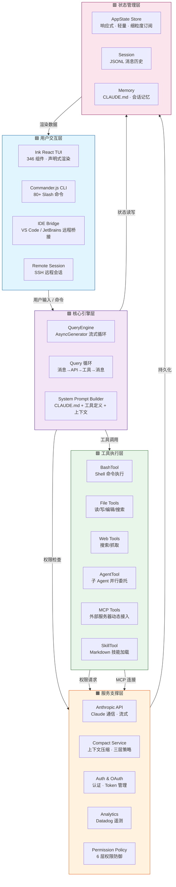
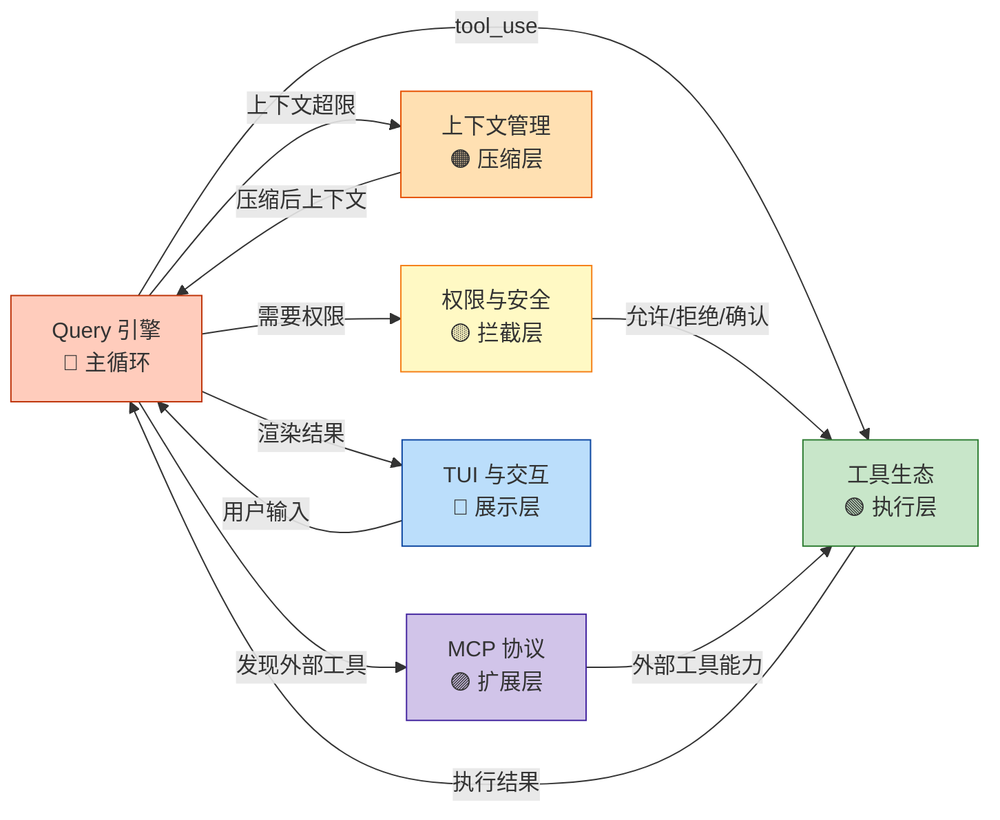
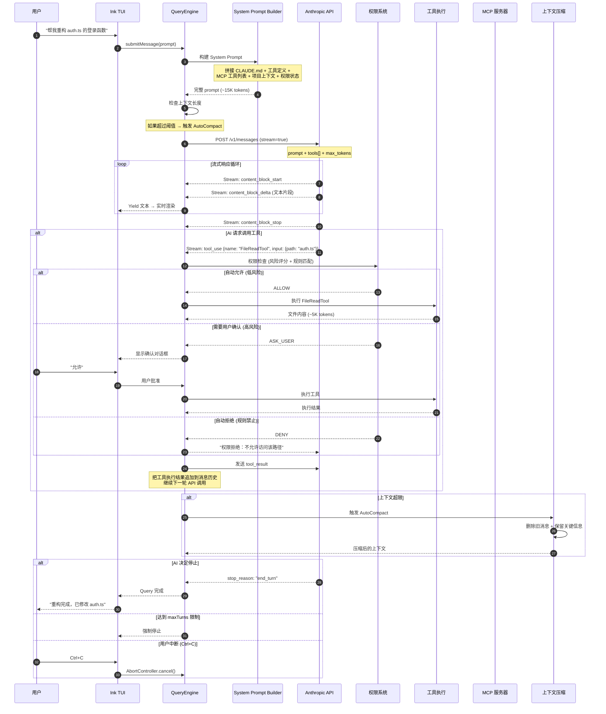
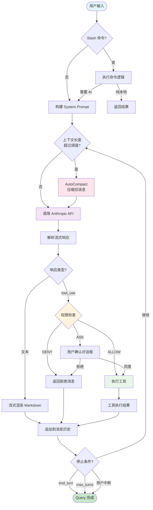
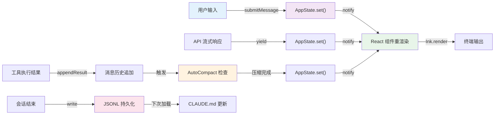

# Claude Code 技术架构解密

> **一份"结构完整 + 细节极深"的系统级技术解析**
> 项目规模：~1,900 TS 文件 / 574 依赖包 / 512K+ 行代码
> 源码来源：[Claude-Code-Compiled](https://github.com/roger2ai/Claude-Code-Compiled)（泄露重建版）

---

# 第一阶段：系统级架构建模

## 1.1 系统边界

Claude Code 是什么？不是"一个调 API 的脚本"，不是"一个终端聊天机器人"。它是一个 **AI 编程助手的完整操作系统**——从终端渲染到权限安全，从上下文管理到多 Agent 协作，每一层都经过精心设计。

**系统边界定义：**

- **输入边界**：用户在终端输入自然语言指令（或通过 IDE Bridge 远程输入）
- **输出边界**：流式文本响应 + 文件系统变更 + Shell 命令执行结果 + MCP 外部服务调用
- **外部依赖**：
  - Anthropic Claude API（核心 LLM 能力来源）
  - 用户本地文件系统（读写权限）
  - 用户本地 Shell 环境（Bash/PowerShell 执行）
  - MCP 外部服务器（GitHub/Slack/数据库等第三方能力）
  - IDE Bridge（VS Code / JetBrains 远程桥接）

**系统解决的问题：** LLM 有知识但无行动力。Claude Code 消除了 AI 编程的"最后一公里断裂"——从"AI 告诉你该做什么"进化到"AI 直接替你做"。

```
断裂点                         Claude Code 的缝合
────────────────────────────   ──────────────────────────
AI 生成代码 → 手动复制粘贴     → FileEditTool 直接写入文件
AI 建议运行测试 → 手动执行     → BashTool 直接执行命令
AI 需要看文件 → 手动打开       → FileReadTool 直接读取
AI 需要搜索 → 手动 Google      → WebSearchTool 直接搜索
AI 需要多步操作 → 手动串联     → Query 循环自动编排
AI 上下文有限 → 手动重开对话   → AutoCompact 自动压缩
```

## 1.2 核心模块划分

系统可划分为 **6 个核心模块**，每个模块职责清晰，边界明确：

| 模块 | 职责 | 核心文件 | 代码规模 |
|------|------|----------|----------|
| **① Query 引擎** | LLM 查询循环——驱动整个系统的"心脏" | QueryEngine.ts / query.ts | ~3000 行 |
| **② 工具生态** | 43 种工具的注册、执行、权限检查 | Tool.ts / tools.ts / BashTool.tsx | ~5000 行 |
| **③ 上下文管理** | 上下文压缩、会话记忆、System Prompt 构建 | services/compact / queryContext.ts | ~2000 行 |
| **④ MCP 协议** | 外部工具服务器的发现、连接、调用 | services/mcp / MCPConnectionManager.ts | ~3000 行 |
| **⑤ 权限与安全** | 6 层权限防御、风险评分、沙箱隔离 | permissions.ts / risk.ts / classifier.ts | ~1500 行 |
| **⑥ TUI 与交互** | React Ink 终端渲染、流式输出、命令系统 | ink.ts / components/ / commands.ts | ~15000 行 |

**模块间关系——谁驱动谁：**

```
Query 引擎 是唯一的主循环驱动者
  ↓ 调用
工具生态（执行具体操作）
  ↓ 依赖
权限与安全（决定是否允许执行）
  ↓ 调用
MCP 协议（连接外部工具服务器）
  ↓ 管理
上下文管理（维护对话历史与压缩）
  ↓ 渲染
TUI 与交互（展示一切给用户）
```

核心洞察：**Query 引擎是系统的唯一主动力源**。所有其他模块都是被动响应——被 Query 循环调用、被工具触发、被权限拦截。理解了 Query 引擎，就理解了整个系统的运转逻辑。

## 1.3 架构风格与设计原则

**架构类型：分层单体 + 插件式扩展**

Claude Code 不是微服务，不是微内核，而是**分层单体**——五层结构自顶向下，数据流单向穿过。但它通过 MCP 协议和 Skill 系统实现了**插件式扩展**，外部能力可以动态接入而不需要修改核心代码。

```
┌─────────────────────────────────────────────────┐
│  用户交互层（TUI / CLI / IDE Bridge / Remote）    │  ← 对外接口
├─────────────────────────────────────────────────┤
│  核心引擎层（QueryEngine / Query 循环 / SP 构建） │  ← 系统心脏
├─────────────────────────────────────────────────┤
│  工具执行层（43 Tools / MCP / AgentTool）         │  ← 能力供给
├─────────────────────────────────────────────────┤
│  服务支撑层（API / Auth / Compact / Analytics）   │  ← 基础设施
├─────────────────────────────────────────────────┤
│  状态管理层（Store / Session / Memory）           │  ← 数据基座
└─────────────────────────────────────────────────┤
```

**为什么选择分层单体？**

- **CLI 工具对启动延迟极度敏感**——单体架构零 IPC 开销，进程内直接调用
- **工具执行需要实时权限检查**——跨进程权限验证会增加不可接受的延迟
- **上下文压缩需要完整消息历史**——分布式状态下消息同步成本高昂
- **单进程内存共享**——346 个 React 组件共享 AppState，零序列化开销

**核心设计原则：**

| 原则 | 体现 | 权衡 |
|------|------|------|
| **解耦** | MCP 协议隔离外部工具 / Skill Markdown 隔离技能逻辑 | 内部模块仍有高耦合（query.ts 1730 行） |
| **扩展** | MCP 动态发现 / Skill 自动加载 / 80+ Slash 命令 | 扩展点设计不统一（工具/技能/命令三种模式） |
| **安全** | 6 层权限防御 / 风险评分 / 用户确认 | 安全层增加执行延迟，用户确认打断自动化 |
| **流式** | AsyncGenerator 全链路 / React Ink 流式渲染 | 流式增加实现复杂度，错误处理更难 |
| **压缩** | AutoCompact / MicroCompact / SessionMemory | 压缩丢失细节，可能影响任务连续性 |

## 1.4 架构图

### 系统分层架构图（C4 Container 级别）



### 模块关系图——数据流向



---

# 第二阶段：系统主线——一条 Query 的完整旅程

## 2.1 唯一主线：请求流

系统有且只有一条主线——**请求流**：从用户输入出发，穿过 Query 循环，经过工具执行，返回 AI 响应，循环往复直到停止。

为什么选择请求流而非数据流或生命周期？因为 Claude Code 的本质是一个 **LLM 驱动的交互式循环**。所有数据流动、状态变更、工具执行，都由"一次 Query"触发。理解一条 Query 的完整旅程，就理解了系统的一切运转逻辑。

## 2.2 流程展开——一条 Query 的完整旅程

### 主线时序图



### 流程图——决策点标注



**关键决策点标注：**

| 决策点 | 决策逻辑 | 影响 |
|--------|----------|------|
| **Slash 命令判断** | 输入以 `/` 开头 → 命令模式 | 命令不走 Query 循环，直接本地执行 |
| **上下文超限** | token_count > threshold → 触发压缩 | 压缩会丢失历史细节，但保证循环不中断 |
| **权限三元决策** | 风险评分 + 规则匹配 → ALLOW/DENY/ASK | DENY 阻断执行但反馈给 LLM；ASK 打断自动化 |
| **停止条件** | stop_reason / maxTurns / 用户中断 | 三种终止路径各有不同后续处理 |

---

# 第三阶段：深度爆破——逐模块深度解析

## 3.1 模块一：Query 引擎——系统的心脏

### 模块职责

Query 引擎管理"对话-工具-再对话"的完整循环。它是系统唯一的主动力源——所有工具调用、权限检查、上下文压缩、流式渲染，都由 Query 循环触发。

### 内部核心机制

**核心算法：AsyncGenerator 流式查询循环**

QueryEngine 的本质是一个 **AsyncGenerator 函数**——每次 yield 一条消息，外部消费者（TUI）可以实时接收，不需要等待整个循环完成。

```
QueryEngine.submitMessage(prompt) → AsyncGenerator<SDKMessage>

循环逻辑（伪代码）：
  while (not stopped) {
    1. 构建 System Prompt
    2. 调用 Anthropic API (stream=true)
    3. 解析流式响应
    4. if (tool_use) → 权限检查 → 工具执行 → 追加结果 → 继续循环
    5. if (content) → yield 文本 → 追加历史
    6. if (stop_reason) → 结束循环
    7. 检查上下文长度 → 触发压缩
  }
```

**关键数据结构：**

- `Message[]`：消息历史数组，每轮 API 调用后追加 user_message + assistant_message + tool_result
- `ToolUseBlock`：工具调用块，包含 id、name、input——LLM 返回的工具调用请求
- `ToolResultBlock`：工具执行结果，包含 toolUseId、content、isError——反馈给 LLM
- `AbortController`：用户中断控制，Ctrl+C 时 cancel()，整个循环优雅退出

**关键执行路径：**

```
submitMessage() 入口
  → buildSystemPrompt()   // 拼接所有上下文
  → query() 循环主体      // 1730 行的核心
    → streamMessages()     // API 流式调用
    → handleToolUse()      // 工具调用分支
      → permissionCheck()  // 权限三元决策
      → tool.execute()     // 工具实际执行
      → appendResult()     // 结果追加到历史
    → handleContent()      // 文本渲染分支
      → yield message      // 流式输出给 TUI
    → checkCompact()       // 上下文长度检查
    → checkStop()          // 停止条件检查
```

### 设计原因

**为什么用 AsyncGenerator 而不是 Promise？**

Promise 表示"一次计算的未来值"。但 Query 循环不是一次计算——它是**多轮交互的流**。每轮可能 yield 一条文本消息、一个工具调用请求、一个进度更新。AsyncGenerator 天然支持：

- 流式输出（yield 一条就渲染一条）
- 循环控制（while not stopped）
- 中断恢复（AbortController）
- 消费者自主节奏（TUI 用 for-await-of 消费）

**替代方案对比：**

| 方案 | 优点 | 缺点 | 为什么不选 |
|------|------|------|-----------|
| Promise 回调 | 简单 | 无法流式、无法中断 | 不满足流式需求 |
| EventEmitter | 灵活 | 无类型安全、回调地狱 | 类型推导差 |
| RxJS Observable | 强大 | 过度复杂、学习曲线 | 杀鸡用牛刀 |
| **AsyncGenerator** | 流式+类型安全+可中断 | 需要消费者理解 for-await-of | ✅ 最贴合需求 |

### 权衡

- **流式 vs 一致性**：流式输出意味着中间状态可能不一致（AI 先说"我来帮你"，然后调用工具失败）。解决方案：工具失败时 yield 错误消息，LLM 在下一轮自行修正。
- **循环深度 vs 费用**：maxTurns 限制循环次数，但太低会打断复杂任务（如多文件重构需要 20+ 轮）。默认值是动态的，根据任务类型调整。
- **上下文完整 vs 窗口限制**：保留完整历史更准确，但 200K token 窗口是硬限制。AutoCompact 是妥协方案。

### 潜在问题

1. **无限循环风险**：如果 LLM 持续调用工具不停，maxTurns 是唯一防线。如果 maxTurns 设置过高，费用失控。
2. **流式错误传播**：流式模式下，已经 yield 的文本无法撤回。如果中途发现错误，只能在下轮修正——用户看到"半成品"。
3. **上下文压缩断裂**：AutoCompact 压缩历史后，LLM 可能"忘记"之前的讨论，导致任务方向偏移。这是 200K 窗口的根本限制，无法完美解决。

---

## 3.2 模块二：工具生态——AI 的手

### 模块职责

43 种工具是 AI 的"手"——让 LLM 从"只能说话"进化到"能做事"。工具生态负责工具注册、参数验证、权限检查前置、执行调度、结果标准化。

### 内部核心机制

**核心算法：Tool 接口与注册表**

所有工具统一实现 `Tool` 接口：

```
interface Tool {
  name: string           // 工具名，LLM 通过此名调用
  description: string    // 描述，LLM 理解何时使用
  inputSchema: JSONSchema // 参数定义，LLM 生成调用参数
  execute(context): ToolResult // 执行逻辑
}
```

工具在 `tools.ts` 中集中注册，构建为一个数组传给 Anthropic API 的 `tools[]` 参数。LLM 看到工具列表后，自主决定何时调用哪个工具。

**关键数据结构：**

- `ToolRegistry`：工具名→工具实例的映射表，query.ts 在每轮循环开始时从注册表获取可用工具
- `ToolUseBlock`：LLM 返回的工具调用请求，包含 id（关联结果）、name（选择哪个工具）、input（调用参数）
- `ToolResult`：统一结果格式 `{content: string, isError: boolean}`——无论 Bash 执行、文件读取还是 MCP 调用，结果都标准化为这个格式

**关键执行路径——以 BashTool 为例：**

```
BashTool.execute(context)
  → securityCheck(command)    // 命令安全检查
    → 检查危险命令列表 (rm -rf /, sudo, 等)
    → 检查路径是否在允许范围内
  → spawnProcess(command)     // 子进程执行
    → Shell 类型选择 (bash / powershell)
    → 环境变量注入 (项目路径等)
    → 超时控制 (默认 120s)
  → captureOutput()           // 输出捕获
    → stdout + stderr 合并
    → 截断超长输出 (>30K chars)
  → formatResult()            // 标准化输出
    → {content: capturedOutput, isError: exitCode !== 0}
```

### 设计原因

**为什么工具定义用 JSON Schema 而不是 TypeScript 类型？**

因为工具定义需要传给 Anthropic API。Claude API 的 `tools[]` 参数要求 JSON Schema 格式——它就是 LLM 看到的"工具说明书"。用 TypeScript 类型定义工具参数，还需要额外转换层。直接用 JSON Schema，一次定义两处使用：LLM 读取 + 运行时验证。

**为什么 43 种工具而不是更少？**

编程工作的操作空间极大——读文件、写文件、搜索文件、执行命令、网络搜索、代码搜索、子任务委托、项目管理……每个操作都有独特的参数、错误处理、输出格式。用"万能工具"（如只用一个 Bash 工具做一切）会导致：

- LLM 需要生成复杂 Shell 命令（容易出错）
- 输出格式不统一（难以解析）
- 权限粒度太粗（要么全允许要么全禁止）

43 种工具是 **粒度与数量的权衡**——每种工具覆盖一个明确的操作域，参数简单，输出标准化，权限可细粒度控制。

### 替代方案

**方案：万能 Bash 工具 + Shell 脚本编排**

只用 BashTool 执行一切操作。LLM 生成 Shell 命令序列：`cat file.txt`、`sed -i 's/old/new/' file.txt`、`npm test`……

**为什么不采用？**
- Shell 命令生成不稳定（LLM 经常生成有语法错误的命令）
- 跨平台兼容性差（bash vs powershell vs zsh）
- 输出格式不可预测（难以标准化）
- 安全风险更高（一条错误命令可能删库）
- 权限无法细粒度控制（允许 Bash = 允许一切）

### 权衡

- **工具数量 vs LLM 选择准确性**：43 种工具让 LLM 的选择空间更大，但也增加了误选概率。解决方案：工具描述精心编写，明确说明适用场景。
- **标准化 vs 特殊需求**：所有工具结果统一为 `{content, isError}`，但某些工具（如 AgentTool）需要更复杂的结果结构。解决方案：content 内部用结构化文本。
- **权限粒度 vs 执行效率**：细粒度权限（每个工具独立权限）更安全，但增加权限检查次数。解决方案：权限策略分层——低风险工具自动允许，高风险工具需要确认。

### 潜在问题

1. **LLM 工具选择错误**：LLM 可能选择错误的工具（如用 FileReadTool 读二进制文件），或生成错误的参数。工具执行层需要健壮的错误处理。
2. **工具爆炸**：随着 MCP 接入更多外部服务器，可用工具可能超过 100 种，LLM 选择准确性会急剧下降。这是未来扩展的核心挑战。
3. **并发安全问题**：多个 AgentTool 子 Agent 同时操作同一文件，可能导致竞态条件。当前方案是文件级锁定，但不完美。

---

## 3.3 模块三：上下文管理——记忆的幻觉

### 模块职责

管理对话历史的生命周期——从构建到压缩到持久化。核心矛盾：200K token 窗口是硬限制，但编程任务需要长上下文。

### 内部核心机制

**三层压缩体系：**

| 层级 | 策略 | 触发条件 | 效果 |
|------|------|----------|------|
| **AutoCompact** | 删除旧消息 + 保留边界 | token_count > threshold | 粗暴但快速，保证循环不中断 |
| **MicroCompact** | 压缩单条工具结果 | 单条消息 > 5K tokens | 精细压缩，保留关键信息 |
| **SessionMemory** | 会话结束摘要 | 用户退出或手动触发 | 跨会话记忆，下次对话可恢复 |

**AutoCompact 核心逻辑（伪代码）：**

```
autoCompact(messages):
  1. 计算 token 总量
  2. 如果超过阈值 (如 180K):
     a. 保留最近 3-5 轮完整对话
     b. 保留所有 System Prompt
     c. 保留未完成的工具调用链
     d. 删除最早的对话轮次
     e. 用 LLM 生成压缩摘要替代删除内容
  3. 更新消息历史
  4. 返回压缩后的上下文
```

**关键数据结构：**

- `Message[]`：消息历史，按时间排序，AutoCompact 操作这个数组
- `CompactSummary`：压缩摘要，替代被删除的消息——一条摘要可能浓缩 10 轮对话
- `CLAUDE.md`：项目级记忆文件，System Prompt 每次构建都读取它——持久化的"项目知识"

**System Prompt 构建链路：**

```
buildSystemPrompt():
  1. 基础身份指令 ("你是 Claude Code，AI 编程助手...")
  2. + CLAUDE.md 内容 (项目级持久记忆)
  3. + 工具定义列表 (43 种工具的 JSON Schema)
  4. + MCP 工具列表 (动态发现的外部工具)
  5. + 项目上下文 (git 状态、目录结构、最近文件)
  6. + 权限状态 (当前权限模式)
  7. + 会话历史 (压缩后的消息数组)
  → 拼接为完整 prompt (~15-30K tokens)
```

### 设计原因

**为什么 AutoCompact 用"删除+摘要"而不是"截断"？**

截断（只保留最近 N 条消息）会丢失任务目标——如果用户在第一条消息说"重构 auth 模块"，截断后 AI 不知道目标了。删除+摘要保留了**压缩后的目标信息**——摘要会包含"用户要求重构 auth 模块，已完成 3/5 步"这样的关键上下文。

**替代方案对比：**

| 方案 | 信息保留 | 成本 | 风险 |
|------|----------|------|------|
| 截断最近 N 条 | 只保留最近 | 零 | 丢失任务目标 |
| 全量摘要 | 压缩比高 | 高（额外 LLM 调用） | 摘要可能遗漏细节 |
| **删除+边界保留+摘要** | 关键信息保留 | 中 | 摘要质量依赖 LLM |
| 向量数据库存储 | 按相关性检索 | 高（基础设施） | 检索质量不确定 |

### 权衡

- **压缩速度 vs 摘要质量**：快速压缩（删除旧消息）牺牲信息完整性；高质量摘要需要额外 LLM 调用，增加延迟和费用。当前方案是混合——删除大部分 + 生成简短摘要。
- **单条压缩 vs 全量压缩**：MicroCompact 压缩单条大消息（如 Bash 输出 50K 字符），AutoCompact 压缩整个历史。两者互补——先微压缩减少单条体积，再自动压缩控制总量。
- **会话内记忆 vs 跨会话记忆**：AutoCompact 和 MicroCompact 是会话内的；CLAUDE.md 和 SessionMemory 是跨会话的。跨会话记忆更持久但更粗略。

### 潜在问题

1. **压缩摘要质量不稳定**：摘要由 LLM 生成，质量随模型能力和任务复杂度波动。复杂任务（多文件重构）的摘要可能遗漏关键细节。
2. **压缩后任务偏移**：压缩后 AI 可能"忘记"中间讨论，导致后续操作方向偏移。用户需要重新说明目标。
3. **CLAUDE.md 信息过载**：如果 CLAUDE.md 太长（超过 5K tokens），挤占有限上下文空间，减少可用对话轮次。
4. **System Prompt 构建成本**：每次 Query 循环开始都重新构建 System Prompt（15-30K tokens），这是固定开销，无法优化。

---

## 3.4 模块四：MCP 协议——无限扩展的接口

### 模块职责

MCP（Model Context Protocol）是 Anthropic 制定的 AI 工具标准化协议。Claude Code 作为 MCP 客户端，可以动态发现和调用任何实现 MCP 协议的外部服务器——从 GitHub 到 Slack 到数据库到浏览器自动化。

### 内部核心机制

**MCP 连接管理生命周期：**

```
MCPConnectionManager:
  1. 读取配置 (mcp_servers in settings)
  2. 为每个服务器创建 Transport:
     - stdio: 本地进程（如 GitHub MCP Server）
     - SSE/StreamableHTTP: 远程 HTTP 服务
  3. 初始化连接 (initialize handshake)
  4. 发现能力 (tools/list, resources/list)
  5. 注册到工具生态 (MCPTool 动态注入)
  6. 监听变更通知 (list_changed → 更新工具列表)
  7. 处理调用请求 (tool call → 路由到对应服务器)
  8. 处理认证 (OAuth flow for remote servers)
  9. 错误恢复 (连接断开 → 自动重连)
```

**关键数据结构：**

- `MCPConnection`：一个 MCP 服务器的完整连接状态——Transport 实例、能力列表、认证状态
- `MCPServerConfig`：用户配置的服务器定义——command/url/env/authentication
- `MCPToolProxy`：动态生成的工具实例——把 MCP 服务器的工具包装为 Claude Code 的 Tool 接口

**工具发现→注册→调用链路：**

```
MCP 服务器启动 → MCPConnectionManager 连接
  → tools/list → 获得工具列表 [{name, description, inputSchema}]
  → 为每个工具创建 MCPToolProxy
  → 注入到 ToolRegistry
  → LLM 看到新工具 → 可能调用
  → MCPToolProxy.execute() → 路由到 MCP 服务器
  → 服务器执行 → 返回结果
  → MCPToolProxy 包装结果为 ToolResult
```

### 设计原因

**为什么用 MCP 协议而不是直接 REST API 集成？**

直接集成每个外部服务需要：
- 为每个服务写专用工具代码
- 为每个服务处理认证
- 为每个服务处理错误格式
- 服务更新时重新发布

MCP 协议标准化了这一切：
- 任何 MCP 服务器自动发现（零代码集成）
- 统一认证流程（OAuth/Token）
- 统一错误格式
- 服务端可以动态更新工具列表（通知机制）

**替代方案：**

| 方案 | 零代码集成 | 认证标准化 | 动态更新 | 实现成本 |
|------|-----------|-----------|---------|---------|
| 直接 REST 集成 | ❌ | ❌ | ❌ | 高 |
| 插件式加载 | 部分 | ❌ | ❌ | 中 |
| **MCP 协议** | ✅ | ✅ | ✅ | 低（协议标准化） |

### 权衡

- **标准化 vs 性能**：MCP 协议增加了一层 Transport 通信开销（stdio 进程间通信或 HTTP 网络延迟）。直接调用 REST API 更快，但牺牲了标准化和可维护性。
- **动态发现 vs 稳定性**：MCP 工具列表可以动态变化（服务器通知 list_changed），但 LLM 的工具选择依赖于稳定的工具列表。如果工具列表在 Query 循环中途变化，可能导致调用不存在工具的错误。
- **OAuth 认证 vs 用户体验**：远程 MCP 服务器需要 OAuth 认证，用户需要跳转浏览器授权。这打断工作流，但保证了安全。

### 潜在问题

1. **MCP 服务器崩溃**：外部服务器不可控，可能崩溃或超时。解决方案：连接超时 + 自动重连 + 错误反馈给 LLM。
2. **工具列表爆炸**：多个 MCP 服务器可能注册大量工具（每个 10-50 个），加上原生 43 种，LLM 的选择空间可能超过 100 种，降低选择准确性。
3. **认证状态不一致**：OAuth token 过期时，工具调用会失败。当前方案是失败时触发重新认证，但打断当前 Query 循环。
4. **stdio 进程泄漏**：本地 MCP 服务器通过子进程启动，如果 Claude Code 异常退出，子进程可能泄漏。解决方案：进程管理 + 退出清理。

---

## 3.5 模块五：权限与安全——六层防御体系

### 模块职责

控制 AI 的行动边界——决定哪些操作可以自动执行，哪些需要用户确认，哪些完全禁止。核心矛盾：权限太严打断自动化流程，权限太松风险失控。

### 内部核心机制

**六层权限防御——从宽松到严格的层层过滤：**

```
Layer 1: 权限模式选择
  → plan: 只能规划，不能执行
  → auto: 低风险自动允许，高风险需确认
  → full: 全部自动允许（危险）

Layer 2: 工具级权限
  → 每个工具独立权限开关
  → 例：允许 BashTool 但禁止 FileWriteTool

Layer 3: 规则匹配
  → 允许/拒绝特定模式
  → 例：允许 Bash "npm test" 但拒绝 Bash "rm -rf"
  → 例：允许读写 src/ 但拒绝读写 ~/.ssh/

Layer 4: 风险评分
  → 对每个操作计算风险分数
  → 基于命令危险度、路径敏感性、操作类型
  → 低风险自动允许，中风险需确认，高风险强制拒绝

Layer 5: 分类器
  → 调用 LLM 判断操作意图
  → 用于模糊场景（命令看起来无害但实际危险）

Layer 6: 沙箱隔离
  → 最危险操作在沙箱中执行
  → 沙箱限制文件系统访问、网络访问、进程权限
```

**权限三元决策：**

```
permissionCheck(toolCall):
  → 通过 6 层过滤后，输出三种结果之一：
  
  ALLOW:   自动允许，不打断用户
           条件：低风险 + 规则允许 + 权限模式允许
  
  DENY:    自动拒绝，反馈给 LLM
           条件：高风险 + 规则禁止 + 或沙箱也无法安全执行
  
  ASK:     需要用户确认，TUI 显示对话框
           条件：中风险 / 规则不明确 / 分类器不确定
```

**关键数据结构：**

- `PermissionMode`：当前权限模式（plan/auto/full）——全局开关
- `PermissionRule`：用户定义的允许/拒绝规则——正则匹配命令和路径
- `RiskScore`：操作的风险评分——0-1 数值，阈值决定 ALLOW/ASK/DENY
- `ClassifierResult`：LLM 分类结果——判断操作意图是否安全

### 设计原因

**为什么用六层而不是一层？**

单层权限（"全部允许"或"全部禁止"）无法处理编程工作的复杂性——你需要允许 AI 运行测试但禁止删除文件，允许读取 src/ 但禁止读取 ~/.ssh/。六层防御提供**渐进式安全**：

- 低风险操作（读文件、搜索）→ 自动允许 → 不打断工作流
- 中风险操作（写文件、执行命令）→ 用户确认 → 安全可控
- 高风险操作（删除文件、危险命令）→ 自动拒绝 → 绝对安全

**替代方案：**

| 方案 | 粒度 | 安全性 | 用户体验 | 为什么不选 |
|------|------|--------|---------|-----------|
| 全部允许 | 无 | ❌ | ✅ | 风险失控 |
| 全部确认 | 无 | ✅ | ❌ | 每步打断 |
| 白名单 | 中 | 中 | 中 | 无法覆盖所有场景 |
| **六层防御** | 高 | 高 | 中 | ✅ 渐进式安全 |

### 权衡

- **安全 vs 流畅**：权限检查增加延迟，用户确认打断自动化。auto 模式是折中——低风险自动通过，高风险才询问。
- **规则精确 vs 覆盖广度**：精确规则（如"允许 npm test"）安全但不灵活；模糊规则（如"允许 npm *"）灵活但有漏洞。当前方案：默认模糊 + 用户可自定义精确规则。
- **分类器成本 vs 准确性**：Layer 5 分类器调用 LLM 判断意图，增加 API 费用和延迟。但某些场景（如 `curl` 命令看起来无害但可能泄露数据）只有 LLM 能判断。

### 潜在问题

1. **用户确认疲劳**：auto 模式下，中风险操作频繁触发确认对话框，用户可能习惯性点击"允许"，导致安全失效。
2. **分类器误判**：LLM 分类器可能将恶意操作误判为安全（如 `curl` 伪装为测试命令）。分类器是补充层，不是绝对防线。
3. **规则冲突**：多条规则可能冲突（"允许 Bash npm *" 和 "拒绝 Bash * --force"）。当前优先级：拒绝规则优先于允许规则。
4. **沙箱逃逸**：沙箱隔离依赖 `@anthropic-ai/sandbox-runtime`，如果沙箱实现有漏洞，危险命令可能逃逸。沙箱是最后防线，但不能保证绝对安全。

---

## 3.6 模块六：TUI 与交互——终端里的声明式 UI

### 模块职责

在终端中渲染一切——流式文本、Markdown 高亮、工具进度、权限对话框、命令面板。核心选择：React Ink——在终端中用 React 声明式渲染。

### 内部核心机制

**React Ink 封装架构：**

```
ink.ts (4685 行的启动逻辑):
  → 初始化 React Ink 渲染器
  → 创建 AppState Store
  → 启动 REPL 交互循环
  → 处理用户输入 → 触发 Query 循环
  → 流式渲染 Query 结果

渲染链路：
  UserInput → AppState.submitMessage()
  → QueryEngine.run() → AsyncGenerator
  → for-await-of 消费每条消息
  → AppState.update() → Store.notify()
  → React 组件重渲染 → Ink 输出到终端
```

**346 个 React 组件的组织：**

```
components/
  → MessageRenderer: 流式消息渲染
  → MarkdownRenderer: Markdown → ANSI 高亮
  → ToolProgressRenderer: 工具执行进度条
  → PermissionDialog: 权限确认对话框
  → CommandPalette: Slash 命令面板
  → InputHandler: 用户输入处理 (Vim 模式支持)
  → ...340+ 其他组件
```

**Slash 命令系统：**

```
commands.ts (80+ 命令注册):
  /help     → 显示帮助
  /clear    → 清除对话历史
  /compact  → 手动触发上下文压缩
  /model    → 切换 LLM 模型
  /config   → 配置管理
  /mcp      → MCP 服务器管理
  /cost     → 显示费用统计
  /memory   → 记忆系统管理
  /status   → 系统状态检查
  ...70+ 其他命令
```

### 设计原因

**为什么用 React Ink 而不是纯终端输出？**

纯终端输出（console.log）无法处理：
- 声明式组件树（嵌套布局、条件渲染）
- 状态驱动的重渲染（流式更新触发组件刷新）
- 丰富的交互组件（对话框、进度条、高亮）

React Ink 把 React 的声明式编程模型带入终端——开发者用 JSX 写终端 UI，Ink 负责渲染到 ANSI 序列。346 个组件证明了声明式模型的规模优势。

**替代方案：**

| 方案 | 组件化 | 流式渲染 | 交互复杂度 | 学习曲线 |
|------|--------|---------|-----------|---------|
| 纯 console.log | ❌ | 部分 | ❌ | 低 |
| blessed/ncurses | 部分 | ❌ | 中 | 高 |
| **React Ink** | ✅ | ✅ | 高 | 中（React 开发者友好） |

### 权衡

- **React 性能开销 vs 声明式开发效率**：React 虚拟 DOM diff 在终端中开销极小（终端"像素"远少于浏览器），所以权衡结果偏向声明式效率。
- **组件数量 vs 可维护性**：346 个组件是大量代码，但每个组件职责单一（如 MarkdownRenderer 只渲染 Markdown），可维护性尚可。
- **Ink 生态局限 vs 定制需求**：Ink 的组件库有限（没有原生表格、图表），需要大量自定义组件。定制成本高但灵活。

### 潜在问题

1. **main.tsx 过度集中**：4685 行的启动逻辑集中了初始化、命令注册、REPL 循环、错误处理。这是最大的单文件耦合热点。
2. **React Compiler 编译**：源码被 React Compiler 编译过，增加了 `$ = _c(n)` 缓存逻辑，降低源码可读性。需要"反编译"思维理解原始意图。
3. **终端渲染限制**：ANSI 序列的能力有限——无法渲染图片、复杂表格、动画。所有视觉表达必须在终端的限制内设计。
4. **流式渲染的竞态**：多条流式消息同时渲染时，可能出现布局错乱（如工具进度条和文本同时更新）。Ink 的 Flex 布局在一定程度上缓解了这个问题。

---

# 第四阶段：数据与状态体系

## 4.1 数据如何流动

Claude Code 的数据流是**单向的**——从用户输入出发，穿过 Query 循环，最终回到终端渲染。没有反向数据流，没有双向绑定。

```
用户输入 → QueryEngine.submitMessage()
  → System Prompt 构建 → 消息数组
  → Anthropic API 调用 → 流式响应
  → 响应解析 → Message/ToolUseBlock/ToolResultBlock
  → 工具执行 → ToolResult
  → 追加到消息历史 → Message[]
  → Store.update() → React 组件重渲染
  → 终端输出
```

**数据蜕变链路：**

| 阶段 | 数据形态 | 大致体积 |
|------|----------|----------|
| 用户输入 | 自然语言字符串 | ~50-500 chars |
| System Prompt | 拼接文本 + JSON Schema | ~15-30K tokens |
| API 请求 | Anthropic API 格式 (messages[]) | ~20-50K tokens |
| 流式响应 | SSE 流 (content_block_delta) | 持续流式 |
| 工具调用 | ToolUseBlock (id + name + input) | ~100-1000 chars |
| 工具结果 | ToolResult (content + isError) | ~1K-50K chars |
| 消息历史 | Message[] (全量对话) | ~50-200K tokens |
| 渲染数据 | ANSI 序列 | ~终端窗口大小 |

## 4.2 状态如何管理

**AppState Store——50 行代码的响应式状态基座：**

```
AppState Store 设计：
  - createStore<T>(initialState) → {get, set, subscribe}
  - get(): 读取当前状态
  - set(partial): 更新状态（浅合并）
  - subscribe(listener): 订阅变更通知
  - 无外部依赖，零配置，类型安全
```

**状态分层：**

| 层级 | 状态类型 | 存储位置 | 生命周期 |
|------|----------|----------|----------|
| **即时状态** | 当前 Query 进度、流式文本 | AppState Store | 单次 Query |
| **会话状态** | 消息历史、工具结果 | JSONL 文件追加 | 单次会话 |
| **持久记忆** | 项目知识、偏好 | CLAUDE.md 文件 | 跨会话永久 |
| **配置状态** | 权限规则、MCP 配置 | settings.json | 跨会话永久 |

**一致性策略：**

- **即时状态**：单进程内存，无并发问题，强一致性
- **会话状态**：JSONL 追加写入，append-only 保证不丢失，但压缩时需要重写
- **持久记忆**：文件读写，无锁——如果多个 Claude Code 实例同时写 CLAUDE.md，可能冲突。当前方案：先读后写，但非原子操作
- **配置状态**：启动时加载，运行时只读——配置变更需要重启生效

## 4.3 状态更新链路



---

# 第五阶段：系统级设计权衡

## 5.1 架构层面的 Trade-off

### 权衡一：分层单体 vs 微服务

**选择：分层单体**

| 维度 | 分层单体 | 微服务 |
|------|----------|--------|
| 启动延迟 | <100ms | 数秒（服务发现+连接） |
| IPC 开销 | 零 | HTTP/gRPC 延迟 |
| 内存效率 | 共享 | 每服务独立（总量更大） |
| 部署复杂度 | 单进程 | 多进程+编排 |
| 扩展方式 | MCP 插件 | 新服务注册 |

**选择理由：** CLI 工具的启动延迟是用户体验的第一道门槛。用户打开终端，敲 `claude`，期望 <200ms 就看到界面。微服务的服务发现和连接建立不可能满足这个要求。MCP 协议已经提供了外部扩展的标准化接口——单体内部，插件式外部。

### 权衡二：流式渲染 vs 批量渲染

**选择：流式渲染（AsyncGenerator + React Ink）**

| 维度 | 流式渲染 | 批量渲染 |
|------|----------|----------|
| 用户感知延迟 | 极低（第一个词 <1s） | 高（整个响应完成后才显示） |
| 实现复杂度 | 高（流式错误处理） | 低（简单请求-响应） |
| 错误恢复能力 | 中（下轮修正） | 高（完整后统一处理） |
| 中断友好性 | 高（AbortController） | 低（中途无法取消） |

**选择理由：** AI 编程助手的核心体验是"AI 在思考时你就能看到"。流式渲染消除了等待焦虑，让用户感觉 AI 在"实时工作"。即使流式实现更复杂，用户体验的提升值得这个代价。

### 权衡三：43 种工具 vs 万能 Bash

**选择：43 种细粒度工具**

已在 3.2 节详细分析。核心论点：粒度工具提供更好的 LLM 选择准确性、跨平台兼容性、输出标准化、权限细粒度控制。

## 5.2 模块层面的 Trade-off

### 权衡四：AutoCompact 摘要质量 vs 响应延迟

**选择：快速粗略摘要**

高质量摘要需要额外的 LLM 调用（上下文 → 摘要），增加 ~5s 延迟和 ~$0.01 费用。快速压缩（删除旧消息 + 保留边界消息）零延迟零费用，但信息丢失更多。

**选择理由：** 压缩在 Query 循环中途触发，用户正在等待 AI 响应。5s 的额外延迟会被用户感知为"卡顿"。信息丢失的风险可以通过 CLAUDE.md 和 SessionMemory 在跨会话层面弥补。

### 权衡五：权限六层防御 vs 执行效率

**选择：六层防御**

每层防御增加一次检查延迟（规则匹配 ~1ms，分类器 ~2s）。累计延迟在低风险操作时 ~1ms（仅规则匹配），高风险操作时 ~2-3s（含分类器 + 用户确认）。

**选择理由：** 安全是 AI 编程助手的信任基石。如果 AI 可以不经确认执行 `rm -rf /`，用户永远不会信任它。2-3s 的确认延迟是"必要的安全税"。

### 权衡六：React Ink vs 纯终端输出

**选择：React Ink**

已在 3.6 节详细分析。核心论点：346 个组件的声明式开发效率远超手动 ANSI 序列拼接，而 React 虚拟 DOM diff 在终端中的性能开销极小。

---

# 第六阶段：扩展性与演进能力

## 6.1 系统如何扩展

Claude Code 有**三个独立的扩展通道**，各覆盖不同维度：

| 扩展通道 | 扩展什么 | 入口 | 难度 | 示例 |
|----------|----------|------|------|------|
| **MCP 协议** | 外部工具/资源 | mcp_servers 配置 | ⭐ | GitHub MCP Server |
| **Skill 系统** | AI 行为/知识 | skills/ 目录 + SKILL.md | ⭐⭐ | 代码审查 Skill |
| **Slash 命令** | 本地操作 | commands/ 目录 + commands.ts | ⭐⭐ | /deploy 命令 |

**MCP 扩展——零代码集成外部能力：**

```
用户在 settings.json 添加：
  "mcp_servers": {
    "github": {
      "command": "github-mcp-server",
      "env": { "GITHUB_TOKEN": "..." }
    }
  }

Claude Code 自动：
  1. 启动 github-mcp-server 进程
  2. 连接 + 发现能力
  3. 注册 GitHub 工具到工具列表
  4. LLM 可以自主调用 GitHub 工具
  → 零代码，零发布，即时可用
```

**Skill 扩展——Markdown 定义 AI 行为：**

```
用户在 skills/code-review/SKILL.md 写：
  "当用户请求代码审查时，执行以下步骤..."
  
Claude Code 自动：
  1. 加载 SKILL.md
  2. 注入到 System Prompt
  3. LLM 遵循 Skill 指令执行
  → 零 TypeScript，纯 Markdown，人人可写
```

## 6.2 是否支持插件机制

**支持，但三种模式不统一。**

MCP 是最成熟的插件机制——标准化协议、动态发现、自动认证。Skill 是最轻量的——纯 Markdown，零代码。Slash 命令是最传统的——需要写 TypeScript，手动注册。

**未来演进方向：统一插件接口**

理想状态是一个 `IPlugin` 接口统一三种扩展：
```
IPlugin {
  name: string
  init(appState): void
  tools(): Tool[]         // MCP 模式
  commands(): Command[]   // 命令模式
  skills(): Skill[]      // Skill 模式
}
```

但目前三种模式的实现差异太大（MCP 是进程间通信，Skill 是文本注入，命令是函数调用），统一需要大量重构。

## 6.3 架构未来如何演进

**演进方向一：Agent 多任务编排**

当前 AgentTool 只支持简单的子 Agent 委托。未来可能进化为：
- 任务 DAG 编排（多 Agent 有依赖关系）
- Agent Pool 管理（并发控制、资源分配）
- Agent 间通信协议（共享上下文、结果传递）

**演进方向二：持久化记忆升级**

当前 CLAUDE.md 是纯文本记忆。未来可能进化为：
- 向量数据库存储（按相关性检索）
- 结构化知识图谱（项目架构、依赖关系）
- 渐进式学习（每次对话自动提炼新知识）

**演进方向三：IDE 深度集成**

当前 IDE Bridge 是简单的远程会话。未来可能进化为：
- 实时协作编辑（AI 和人类同时编辑同一文件）
- 语义理解集成（LSP 代码理解直接注入上下文）
- 可视化架构图（AI 生成架构图，IDE 直接展示）

**演进瓶颈：**

- **上下文窗口**：200K token 限制了多 Agent 协作和长任务。上下文窗口扩大（1M+ tokens）是最根本的演进前提。
- **单体耦合**：query.ts 1730 行和 main.tsx 4685 行是重构瓶颈。模块化拆分需要大量工作但收益不确定。
- **React Compiler**：编译后的代码降低可维护性。未来可能去掉 Compiler 或提供源码级调试工具。

---

# 第七阶段：附录

## 7.1 配置体系

**配置层次结构：**

| 层级 | 文件 | 作用 | 优先级 |
|------|------|------|--------|
| 全局 | ~/.claude/settings.json | 用户级默认配置 | 最低 |
| 项目 | .claude/settings.json | 项目级配置覆盖 | 中 |
| 命令行 | --flag 参数 | 单次运行配置覆盖 | 最高 |

**关键配置项：**

| 配置项 | 默认值 | 作用 |
|--------|--------|------|
| `permission_mode` | auto | 权限模式 |
| `max_turns` | 动态 | Query 循环最大轮数 |
| `model` | claude-sonnet-4-20250514 | 默认 LLM 模型 |
| `mcp_servers` | {} | MCP 服务器配置 |
| `allowed_tools` | [] | 工具级权限白名单 |
| `denied_tools` | [] | 工具级权限黑名单 |
| `custom_rules` | [] | 自定义权限规则 |

## 7.2 插件机制详述

已在第六阶段覆盖。补充 MCP 服务器配置示例：

```json
{
  "mcp_servers": {
    "github": {
      "command": "npx",
      "args": ["-y", "@modelcontextprotocol/server-github"],
      "env": { "GITHUB_PERSONAL_ACCESS_TOKEN": "ghp_..." }
    },
    "postgres": {
      "command": "npx",
      "args": ["-y", "@modelcontextprotocol/server-postgres"],
      "env": { "POSTGRES_URL": "postgresql://..." }
    },
    "remote-browser": {
      "url": "https://browser-mcp.example.com/mcp",
      "authentication": { "type": "oauth", "client_id": "..." }
    }
  }
}
```

## 7.3 部署流程

**本地安装：**

```bash
npm install -g @anthropic-ai/claude-code
# 或
bun install -g @anthropic-ai/claude-code

claude --version  # 验证安装
claude            # 启动交互式 REPL
```

**远程会话（SSH）：**

```bash
ssh user@remote-server
claude  # 在远程服务器上运行，本地终端交互
```

**IDE 集成（VS Code）：**

1. 安装 Claude Code VS Code Extension
2. Extension 启动 Claude Code 进程
3. 通过 Bridge 协议双向通信
4. AI 可以直接在 IDE 中操作文件

## 7.4 扩展接口速查

| 扩展类型 | 接口 | 注册方式 | 文档位置 |
|----------|------|----------|----------|
| 新工具 | `Tool` 接口 | `tools.ts` 注册 | `src/tools/` |
| 新 MCP 服务器 | MCP 协议 | `settings.json` 配置 | MCP 规范文档 |
| 新 Skill | SKILL.md | `skills/` 目录自动加载 | Skill 目录 |
| 新命令 | Commander.js | `commands.ts` 注册 | `src/commands/` |
| 新 TUI 组件 | React 组件 | Ink 渲染树 | `src/components/` |
| 权限规则 | PermissionRule | `settings.json` 配置 | 权限系统文档 |

## 7.5 核心文件索引

| 文件 | 行数 | 职责 | 分析深度 |
|------|------|------|----------|
| `src/core/queryEngine.ts` | 1296 | Query 循环核心引擎 | 🔴 已深度解析 |
| `src/core/query.ts` | 1730 | Query 循环逻辑主体 | 🔴 已深度解析 |
| `src/tools/Tool.ts` | 793 | 工具接口定义与注册 | 🔴 已深度解析 |
| `src/main.tsx` | 4685 | 启动逻辑与 REPL | 🟡 已概述 |
| `src/ink.ts` | ~200 | Ink 渲染封装 | 🟡 已概述 |
| `src/state/AppState.tsx` | ~150 | 全局状态定义 | 🟡 已概述 |
| `src/state/store.ts` | ~50 | Store 实现 | 🟢 已概述 |
| `src/services/mcp/client.ts` | ~500 | MCP 客户端 | 🔴 已深度解析 |
| `src/services/compact/` | ~500 | 上下文压缩 | 🔴 已深度解析 |
| `src/utils/permissions.ts` | ~300 | 权限检查 | 🔴 已深度解析 |

## 7.6 项目统计

| 指标 | 数值 |
|------|------|
| TypeScript 文件数 | ~1,900 |
| 依赖包数 | 574 |
| 代码总行数 | 512K+ |
| React 组件数 | 346 |
| 工具数 | 43 |
| Slash 命令数 | 80+ |
| MCP 支持传输类型 | stdio / SSE / StreamableHTTP |
| 权限防御层数 | 6 |
| 压缩策略层数 | 3 |

---

# 自检清单

| 检查项 | 状态 |
|--------|------|
| 1. 是否先建立完整架构？ | ✅ 第一阶段完成系统建模 + 架构图 |
| 2. 是否所有深度分析都挂靠模块？ | ✅ 第三阶段逐模块深度爆破 |
| 3. 是否解释设计原因？ | ✅ 每个模块都有"设计原因"和"替代方案" |
| 4. 是否既有结构又有细节？ | ✅ 分层架构图 + 模块关系图 + 流程图 + 时序图 + 源码级说明 |
| 5. 是否分析权衡？ | ✅ 第五阶段系统级 + 模块级 Trade-off |
| 6. 是否指出潜在问题？ | ✅ 每个模块都有"潜在问题" |
| 7. 是否说明扩展与演进？ | ✅ 第六阶段完成 |

---

*Claude Code 技术架构解密 · OPNA-Ultimate 协议 · 首席系统架构师视角*
*项目来源：E:\github-trending\Claude-Code-Compiled · 分析时间：2026-04-14*