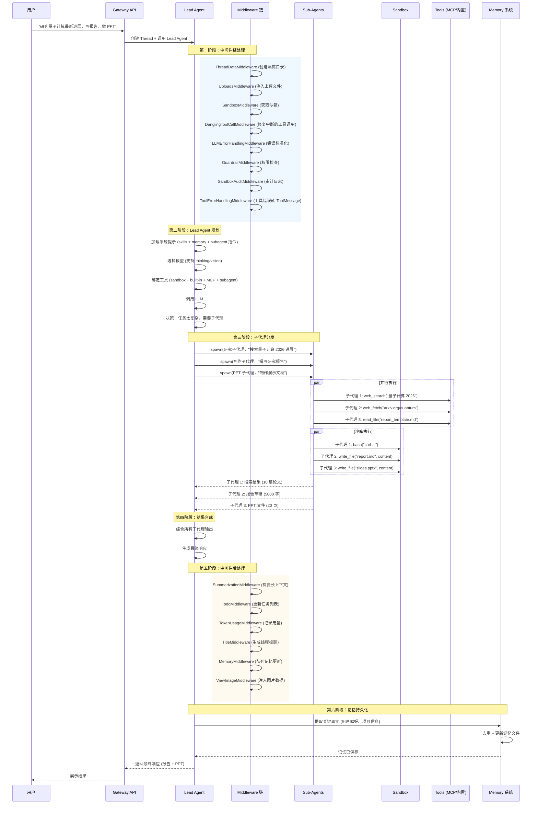
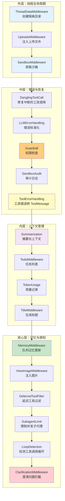
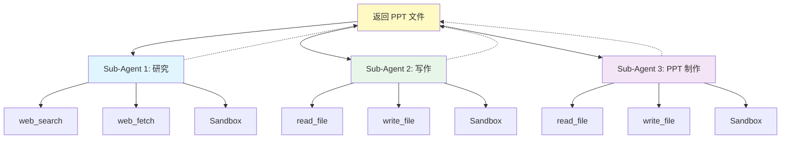
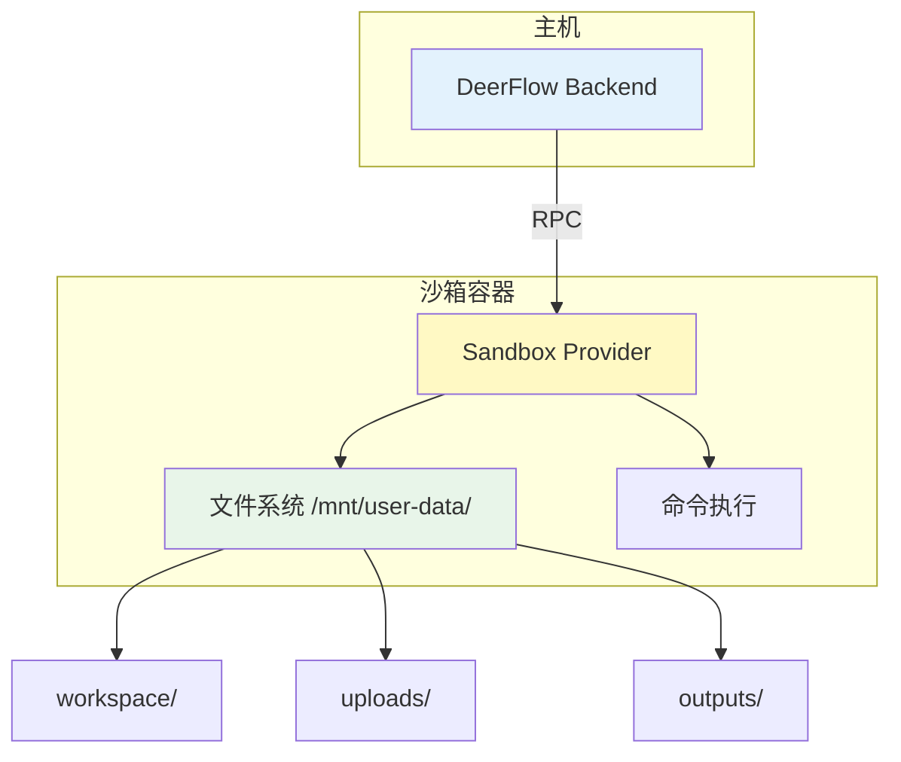
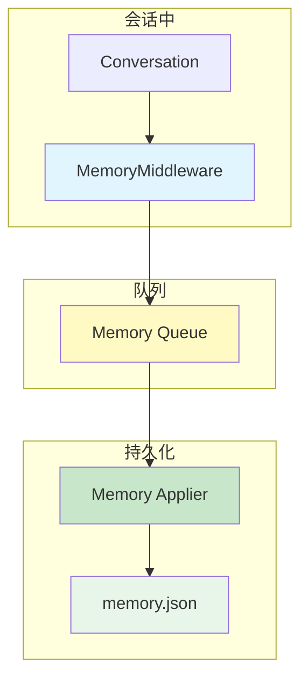

# DeerFlow 架构深度解析

> **从 Deep Research 到 Super Agent Harness**  
> 一个研究任务被分解、执行、合成的完整旅程，和"上下文工程"的设计哲学  
> 版本：2.0 | 分析时间：2026-04-13

---

## 开场：AI 代理的"单线程困境"

> **场景：** 你对 AI 说"帮我研究一下量子计算的最新进展，写一份报告，做成 PPT"。  
> **问题：** 单个 LLM 调用只能做一件事 —— 要么搜索，要么写作，要么做 PPT。它不能同时做三件事，也不能在搜索时发现新方向然后调整计划。

这就是 AI 代理的 **"单线程困境"** —— 一个模型、一个上下文、一次调用，只能产生一次输出。复杂任务需要多步骤、多视角、多轮迭代，但传统架构不支持。

**DeerFlow 的回答：**

> **Lead Agent + Sub-Agents + Sandbox + Memory = Super Agent Harness**

DeerFlow 不是一个单一的 AI 代理，而是一个 **代理编排系统（Agent Harness）**。它有一个 **Lead Agent**（主代理）负责规划和协调，多个 **Sub-Agents**（子代理）并行执行具体任务，一个 **Sandbox**（沙箱）提供安全的执行环境，一个 **Memory**（记忆）系统跨会话持久化知识。

**如果没有它，你会失去什么？**

| 痛点 | 现状 | DeerFlow 的方案 |
|------|------|----------------|
| **单代理能力有限** | 一个模型做所有事 | Lead Agent 规划 + Sub-Agents 执行 |
| **长任务上下文爆炸** | 100k tokens 也不够用 | 上下文工程（摘要、卸载、压缩） |
| **会话结束就遗忘** | 每次对话从零开始 | 长期记忆（跨会话持久化） |
| **代码执行不安全** | 直接在主机上跑 | 沙箱隔离（Docker/Container） |
| **工具扩展困难** | 硬编码工具列表 | MCP 协议 + 技能系统 |

---

## 主线：一个研究任务的完整旅程

让我们跟随一个真实的复杂任务，看看 DeerFlow 内部发生了什么。

**场景：** 用户说 "帮我研究量子计算的最新进展，写一份报告，做成 PPT"



**旅程中的六个阶段，也是 DeerFlow 的六个核心机制：**

1. **中间件链** —— 18 层中间件处理线程生命周期
2. **Lead Agent** —— 动态模型选择 + 工具编排
3. **Sub-Agents** —— 并行任务分解与执行
4. **Sandbox** —— 隔离的文件系统和命令执行
5. **上下文工程** —— 摘要、卸载、压缩
6. **长期记忆** —— 跨会话持久化知识

接下来，逐个拆解这些机制。

---

## 机制一：中间件链 —— 18 层"洋葱架构"

### TL;DR
> DeerFlow 的 Lead Agent 不是直接调用 LLM，而是通过 **18 层中间件** 组成的"洋葱架构"。每层中间件负责一个横切关注点（线程数据、沙箱、错误处理、记忆等）。请求从外向内穿透，响应从内向外返回。

### 中间件全景图



### 关键中间件详解

**1. ThreadDataMiddleware（线程数据）**

```python
# 为每个 thread_id 创建隔离的目录结构
backend/.deer-flow/threads/{thread_id}/user-data/
├── workspace/    # 代理工作目录
├── uploads/      # 用户上传文件
└── outputs/      # 最终交付物

# Web UI 删除线程时，Gateway 会清理这个目录
DELETE /api/threads/{thread_id}
  → 删除 LangGraph 线程
  → 清理 .deer-flow/threads/{thread_id}
```

> **设计洞察：** 线程隔离不仅是内存中的，也是**文件系统级别的**。每个会话有独立的"工作空间"，互不干扰。

**2. DanglingToolCallMiddleware（悬空工具调用修复）**

```python
# 场景：用户中断了代理执行，LLM 的工具调用没有收到响应
# 问题：下次调用时，LLM 期望工具结果，但历史中没有
# 解决：注入占位符 ToolMessage

if aimessage.tool_calls and not has_matching_tool_result:
    inject_placeholder_tool_message(
        tool_call_id=tool_call["id"],
        content="Tool call was interrupted by user"
    )
```

> **工程真实感：** 这是 DeerFlow 在真实使用中遇到的问题 —— 用户中断导致工具调用"悬空"，下次 LLM 调用会失败。这个中间件专门修复这种边缘情况。

**3. GuardrailMiddleware（护栏）**

```python
# 三种护栏提供者选项：
# 1. AllowlistProvider (内置，零依赖)
# 2. OAP policy providers (如 aport-agent-guardrails)
# 3. 自定义提供者

# 配置示例
guardrails:
  enabled: true
  provider: "AllowlistProvider"
  config:
    allowed_tools: ["web_search", "read_file", "write_file"]
    denied_tools: ["bash", "delete_file"]
```

> **安全边界：** 护栏是**可插拔的**。你可以用简单的白名单，也可以用外部的策略引擎。DeerFlow 只定义协议，不强制实现。

**4. LoopDetectionMiddleware（循环检测）**

```python
# 检测工具调用循环（LLM 重复调用相同工具）
# 如果检测到循环，强制停止并返回文本答案

if detect_tool_call_loop(history):
    # 清除结构化 tool_calls 和原始 provider tool-call 元数据
    clear_tool_calls_from_aimessage()
    force_final_text_answer("Detected tool call loop, stopping.")
```

> **为什么需要清除原始元数据？** OpenAI 兼容的模型严格验证 `tool_call_id` 序列。如果历史中有悬空的工具调用，下次调用会失败。清除元数据是为了保持历史一致性。

**5. ClarificationMiddleware（澄清拦截）**

```python
# 拦截 ask_clarification 工具调用
# 通过 Command(goto=END) 中断执行
# 必须放在中间件链的最后

if tool_call.name == "ask_clarification":
    return Command(goto=END)  # 中断代理循环
```

> **设计精妙之处：** `ask_clarification` 是一个特殊工具 —— 它不是要执行，而是要**中断**代理循环，等待用户回答。所以它必须放在中间件链的最后，确保所有其他处理都已完成。

### 设计权衡：为什么用中间件而不是硬编码？

| 方案 | 优势 | 劣势 | DeerFlow 选择 |
|------|------|------|--------------|
| **硬编码在 Agent 中** | 简单、直接 | 难以扩展、难以测试 | ❌ |
| **中间件链** | 可插拔、可测试、职责分离 | 复杂度增加、调试困难 | ✅ |
| **事件总线** | 完全解耦 | 过度设计、难以追踪 | ❌ |

> **决策理由：** 中间件链是 **LangGraph/LangChain 的标准模式**。它提供了足够的扩展性，同时保持了调用栈的可追踪性。DeerFlow 的 18 层中间件按严格顺序组装，每层都有明确的职责边界。

---

## 机制二：Lead Agent —— 动态模型 + 工具编排

### TL;DR
> Lead Agent 是 DeerFlow 的入口点。它不是固定的，而是**动态工厂** —— 根据配置选择模型、加载工具、应用系统提示、绑定中间件。它支持 thinking 模式、vision 能力、动态模型切换。

### Lead Agent 工厂函数

```python
def make_lead_agent(config: RunnableConfig) -> CompiledStateGraph:
    """创建 Lead Agent 的工厂函数。"""

    # 1. 动态模型选择
    model_name = config.configurable.get("model_name")
    thinking_enabled = config.configurable.get("thinking_enabled", False)
    model = create_chat_model(name=model_name, thinking_enabled=thinking_enabled)

    # 2. 工具加载
    tools = get_available_tools()  # sandbox + built-in + MCP + subagent

    # 3. 系统提示生成
    system_prompt = apply_prompt_template(
        skills=loaded_skills,
        memory=memory_context,
        subagent_instructions=subagent_docs
    )

    # 4. 中间件链组装
    middlewares = build_lead_runtime_middlewares(
        include_uploads=True,
        include_dangling_tool_call_patch=True,
    )

    # 5. 创建 Agent
    agent = create_agent(
        model=model,
        tools=tools,
        middlewares=middlewares,
        prompt=system_prompt,
    )

    return agent
```

### 动态模型选择

```yaml
# config.yaml
models:
  - name: gpt-4o
    display_name: GPT-4o
    use: langchain_openai:ChatOpenAI
    model: gpt-4o
    api_key: $OPENAI_API_KEY

  - name: openrouter-gemini-2.5-flash
    display_name: Gemini 2.5 Flash (OpenRouter)
    use: langchain_openai:ChatOpenAI
    model: google/gemini-2.5-flash-preview
    api_key: $OPENROUTER_API_KEY
    base_url: https://openrouter.ai/api/v1

  - name: gpt-5-responses
    display_name: GPT-5 (Responses API)
    use: langchain_openai:ChatOpenAI
    model: gpt-5
    api_key: $OPENAI_API_KEY
    use_responses_api: true  # 使用 OpenAI Responses API
    output_version: responses/v1
```

> **关键设计：** DeerFlow 不绑定特定模型提供商。它使用 **LangChain 的模型抽象**，支持任何 OpenAI 兼容的 API。这意味着你可以用 OpenAI、Anthropic、Google、本地 vLLM、Ollama —— 任何实现了 OpenAI 接口的模型。

### 工具加载策略

```python
def get_available_tools() -> list[BaseTool]:
    """组合所有可用工具。"""

    tools = []

    # 1. Sandbox 工具 (bash, ls, read_file, write_file)
    tools.extend(get_sandbox_tools())

    # 2. 内置工具 (present_files, ask_clarification, view_image)
    tools.extend(get_builtin_tools())

    # 3. MCP 工具 (从配置的 MCP 服务器加载)
    tools.extend(get_mcp_tools())

    # 4. 社区工具 (Tavily, Jina AI, Firecrawl 等)
    tools.extend(get_community_tools())

    # 5. 子代理工具 (task 工具，用于分发给子代理)
    if subagent_enabled:
        tools.append(SubagentTool())

    return tools
```

> **工具即插件：** DeerFlow 的工具系统是**完全可扩展的**。你可以添加自己的工具，只要实现 LangChain 的 `BaseTool` 接口。MCP 协议让这个过程更简单 —— 任何 MCP 服务器都可以被 DeerFlow 识别为工具源。

---

## 机制三：Sub-Agents —— 并行任务分解

### TL;DR
> 子代理是 DeerFlow 处理复杂任务的核心机制。Lead Agent 可以动态生成子代理，每个子代理有**隔离的上下文**、**专用的工具集**、**独立的终止条件**。子代理并行执行，返回结构化结果，Lead Agent 负责合成。

### 子代理架构



### 子代理执行器

```python
class SubagentExecutor:
    """后台执行引擎，管理子代理的生命周期。"""

    async def spawn(
        self,
        agent_name: str,
        task: str,
        context: dict | None = None,
    ) -> SubagentResult:
        """生成一个新的子代理。"""

        # 1. 创建隔离的上下文
        isolated_context = self._build_isolated_context(
            parent_context=context,
            agent_name=agent_name,
        )

        # 2. 选择模型（可以是不同于 Lead Agent 的模型）
        model = self._select_model_for_task(task)

        # 3. 绑定工具（子代理可能只有部分工具）
        tools = self._select_tools_for_role(agent_name)

        # 4. 执行子代理
        result = await self._run_agent(
            agent_name=agent_name,
            task=task,
            model=model,
            tools=tools,
            context=isolated_context,
        )

        return result

    def _build_isolated_context(self, parent_context, agent_name):
        """构建隔离的上下文，子代理看不到父代理的历史。"""
        return {
            "agent_name": agent_name,
            "task": parent_context.get("task"),
            # 不继承 parent_context["messages"]
        }
```

> **关键设计：** 子代理的上下文是**隔离的**。它看不到 Lead Agent 的完整对话历史，只能看到任务相关的信息。这确保了子代理专注于当前任务，不会被父代理的上下文分散注意力。

### 子代理限制中间件

```python
class SubagentLimitMiddleware(AgentMiddleware):
    """限制并发子代理数量，防止模型生成过多 task 工具调用。"""

    MAX_CONCURRENT_SUBAGENTS = 5

    async def __call__(self, state, next):
        response = await next(state)

        # 检查模型是否生成了过多的 task 工具调用
        tool_calls = response.message.tool_calls
        task_calls = [c for c in tool_calls if c["name"] == "task"]

        if len(task_calls) > self.MAX_CONCURRENT_SUBAGENTS:
            # 截断多余的调用
            response.message.tool_calls = (
                tool_calls[:5] + [c for c in tool_calls if c["name"] != "task"]
            )

        return response
```

> **工程洞察：** 模型有时会"兴奋"地生成过多的子代理调用（10 个、20 个）。这不仅浪费资源，也会导致上下文爆炸。这个中间件强制限制并发数量，确保系统稳定。

### 模型选择策略

```
DeerFlow 不是一刀切地用最贵的模型。它根据任务角色选择：

研究子代理 (web_search, web_fetch):
  → 标准模型 (如 GPT-4o)
  需要理解搜索结果，但不需要深度推理

写作子代理 (read_file, write_file):
  → 标准或强大模型 (如 Claude Sonnet)
  需要理解文档结构、写作风格

PPT 子代理 (write_file, 模板填充):
  → 标准模型
  机械性任务，不需要深度推理

Lead Agent (规划、合成):
  → 最强大的模型 (如 Claude Opus / GPT-5)
  需要全局视野、判断力、综合能力
```

> **类比：** 这就像一个工程团队 —— 初级工程师做机械实现，中级工程师做集成，高级工程师做架构和审查。DeerFlow 用不同模型扮演不同角色，优化成本和质量的平衡。

---

## 机制四：Sandbox —— 隔离的执行环境

### TL;DR
> DeerFlow 不只是"聊天"，它有**自己的计算机**。每个任务有自己的沙箱环境，包含完整的文件系统视图。代理可以读、写、编辑文件，可以执行 shell 命令（在安全模式下）。沙箱是隔离的，不会影响主机。

### 沙箱架构



### 沙箱提供者

```python
# 两种沙箱提供者
class LocalSandboxProvider(SandboxProvider):
    """本地沙箱，文件映射到主机目录，bash 默认禁用。"""

    def __init__(self, thread_id: str):
        self.root = f"backend/.deer-flow/threads/{thread_id}/user-data"

    async def read_file(self, path: str) -> str:
        # 映射到主机文件系统
        return Path(self.root, path).read_text()

    async def write_file(self, path: str, content: str) -> None:
        Path(self.root, path).write_text(content)

    async def bash(self, command: str) -> str:
        # 默认禁用，因为主机 bash 不是安全隔离边界
        raise SecurityError("Host bash is disabled by default")


class AioSandboxProvider(SandboxProvider):
    """Docker 容器沙箱，完全隔离。"""

    async def bash(self, command: str) -> str:
        # 在 Docker 容器中执行
        result = await docker_client.exec(
            container_id=self.container_id,
            command=command,
        )
        return result.stdout
```

### 沙箱目录结构

```
/mnt/user-data/
├── uploads/          # 用户上传的文件
├── workspace/        # 代理的工作目录
└── outputs/          # 最终交付物

/mnt/skills/public/
├── research/SKILL.md
├── report-generation/SKILL.md
├── slide-creation/SKILL.md
├── web-page/SKILL.md
└── image-generation/SKILL.md

/mnt/skills/custom/
└── your-custom-skill/SKILL.md
```

> **安全边界：** `LocalSandboxProvider` 默认**禁用主机 bash**，因为主机不是安全隔离边界。如果你需要执行 shell 命令，应该用 `AioSandboxProvider`（Docker 容器）。这是 DeerFlow 的安全默认值。

### 沙箱审计中间件

```python
class SandboxAuditMiddleware(AgentMiddleware):
    """审计沙箱操作，记录安全日志。"""

    async def __call__(self, state, next):
        response = await next(state)

        # 记录所有沙箱操作
        for tool_call in response.message.tool_calls:
            if tool_call["name"] in ["bash", "write_file", "delete_file"]:
                logger.info(
                    f"Sandbox operation: {tool_call['name']} "
                    f"args={tool_call['arguments']}"
                )

        return response
```

> **审计日志：** 所有沙箱操作都会被记录。这不仅是为了安全，也是为了调试 —— 你可以追溯代理做了什么，为什么这么做。

---

## 机制五：上下文工程 —— 对抗遗忘的艺术

### TL;DR
> DeerFlow 的上下文管理不是"越多越好"，而是** aggressive 的摘要、卸载、压缩**。它在会话中摘要已完成的子任务，将中间结果卸载到文件系统，压缩不再立即相关的内容。这让它能处理分钟到小时级的长任务，而不会撑爆上下文窗口。

### 摘要中间件

```python
class SummarizationMiddleware(AgentMiddleware):
    """当接近 token 限制时，摘要旧消息。"""

    def __init__(self, trigger: TriggerConfig, keep: KeepConfig, model: ChatModel):
        self.trigger = trigger  # 触发条件（如 tokens > 80%）
        self.keep = keep        # 保留多少条最近消息
        self.model = model      # 用于摘要的模型

    async def __call__(self, state, next):
        messages = state["messages"]

        # 检查是否需要摘要
        if self.should_summarize(messages):
            # 保留最近的 N 条消息
            recent = messages[-self.keep.recent_count:]

            # 摘要旧消息
            old = messages[:-self.keep.recent_count]
            summary = await self.summarize(old)

            # 替换为摘要 + 最近消息
            state["messages"] = [summary] + recent

        return await next(state)
```

### 配置示例

```yaml
# config.yaml
summarization:
  enabled: true
  trigger:
    type: "token_percentage"
    threshold: 0.8  # 当 tokens 达到 80% 时触发
  keep:
    recent_count: 10  # 保留最近 10 条消息
  model_name: "gpt-4o-mini"  # 用轻量模型做摘要，节省成本
```

> **成本优化：** DeerFlow 允许用**不同的模型做摘要**。你可以用便宜的模型（如 GPT-4o-mini）做摘要，用强大的模型（如 GPT-5）做主要推理。这显著降低了长任务的成本。

### 严格工具调用恢复

```python
# 当提供商或中间件中断工具调用循环时
# DeerFlow 会：
# 1. 清除强制停止的 assistant 消息中的原始工具调用元数据
# 2. 为悬空的工具调用注入占位符 tool_result
# 3. 然后才进行下一次模型调用

# 为什么？OpenAI 兼容的模型严格验证 tool_call_id 序列
# 如果历史中有悬空的工具调用，下次调用会失败
```

> **工程真实感：** 这是 DeerFlow 在真实使用中遇到的问题 —— 用户中断导致工具调用"悬空"，下次 LLM 调用会因为 malformed history 而失败。这个机制专门修复这种边缘情况。

---

## 机制六：长期记忆 —— 跨会话的"你"

### TL;DR
> 大多数 AI 代理在会话结束时就遗忘了一切。DeerFlow 不会。它跨会话构建持久的记忆 —— 你的档案、偏好、积累的知识。你用得越多，它越了解你 —— 你的写作风格、你的技术栈、你的重复工作流。

### 记忆架构



### 记忆中间件

```python
class MemoryMiddleware(AgentMiddleware):
    """队列对话，用于异步记忆更新。"""

    def __init__(self, memory_queue: MemoryQueue):
        self.memory_queue = memory_queue

    async def __call__(self, state, next):
        response = await next(state)

        # 过滤到用户消息 + 最终 AI 响应
        user_messages = [m for m in state["messages"] if m.type == "human"]
        ai_responses = [m for m in response.message if m.type == "ai"]

        # 队列记忆更新（异步处理）
        await self.memory_queue.enqueue(
            user_messages=user_messages,
            ai_responses=ai_responses,
        )

        return response
```

### 记忆去重

```python
# 记忆更新时跳过重复的事实条目
# 防止重复的偏好和上下文无限累积

def apply_memory_facts(new_facts, existing_facts):
    """应用新事实，跳过重复。"""
    for fact in new_facts:
        # 检查是否已存在相同内容
        if not any(f["content"] == fact["content"] for f in existing_facts):
            existing_facts.append(fact)
        # 如果已存在，更新置信度
        else:
            existing_fact = next(f for f in existing_facts if f["content"] == fact["content"])
            existing_fact["confidence"] = max(existing_fact["confidence"], fact["confidence"])
```

> **洞察：** 没有去重的话， repeated preferences 会无限累积（"用户喜欢 TypeScript" 出现 100 次）。去重确保记忆保持简洁、相关。

### 记忆文件结构

```json
{
  "facts": [
    {
      "content": "用户偏好 TypeScript 而不是 Python",
      "category": "preferences",
      "confidence": 0.95,
      "source": "Manual",
      "created_at": "2026-04-13T10:00:00Z"
    },
    {
      "content": "项目使用 Next.js + Tailwind 技术栈",
      "category": "projects",
      "confidence": 0.88,
      "source": "Extracted",
      "created_at": "2026-04-13T11:00:00Z"
    }
  ],
  "summaries": [
    {
      "session_id": "abc123",
      "summary": "用户请求研究量子计算，生成报告和 PPT",
      "created_at": "2026-04-13T12:00:00Z"
    }
  ]
}
```

---

## 技术选型分析

### 项目类型识别

DeerFlow 是一个 **LangGraph 驱动的多代理编排系统**。它的核心创新不是新的模型、新的算法，而是**上下文工程 + 子代理分解 + 沙箱隔离**的工程化组合。

### 为什么选择 LangGraph？

| 维度 | LangGraph | 自建编排 | 其他框架 (AutoGen/CrewAI) |
|------|-----------|---------|-------------------------|
| **状态管理** | 内置 State Graph | 需要自己实现 | 有，但抽象层级不同 |
| **中间件支持** | Agent Middleware 协议 | 需要自己设计 | 有限 |
| **工具调用** | LangChain 生态 | 需要自己集成 | 有，但绑定特定模型 |
| **流式支持** | 内置 SSE 协议 | 需要自己实现 | 有限 |
| **可观测性** | LangSmith/Langfuse 集成 | 需要自己开发 | 有限 |

> **决策理由：** LangGraph 提供了**状态图 + 中间件 + 工具调用**的完整抽象。DeerFlow 不需要重新发明轮子，而是专注于**代理行为塑造**和**上下文工程**。

### Harness/App 分离架构

```
DeerFlow 后端分为两层：

Harness (packages/harness/deerflow/):
  - 可发布的 agent framework 包
  - 导入前缀：deerflow.*
  - 包含：代理编排、工具、沙箱、模型、MCP、技能、配置
  - 一切构建和运行代理所需的内容

App (backend/app/):
  - 未发布的应用代码
  - 导入前缀：app.*
  - 包含：FastAPI Gateway API、IM 渠道集成

依赖规则：
  - App 可以导入 deerflow
  - deerflow 不能导入 app
  - 由 tests/test_harness_boundary.py 在 CI 中强制执行
```

> **设计洞察：** Harness/App 分离让 **deerflow-harness 可以独立发布**。这意味着其他人可以用 DeerFlow 的 agent framework 构建自己的应用，而不需要 FastAPI Gateway 或 IM 渠道。

### 为什么用 TypeScript + Python 混合栈？

| 组件 | 技术栈 | 理由 |
|------|--------|------|
| **Backend** | Python 3.12+ | LangChain/LangGraph 生态、AI 工具链 |
| **Frontend** | Next.js (TypeScript) | 现代 Web UI、组件生态、类型安全 |
| **Gateway** | FastAPI (Python) | 异步、自动文档、Pydantic 验证 |
| **代理运行时** | LangGraph (Python) | 状态图、中间件、工具调用 |

> **诚实的缺点：** 混合栈增加了运维复杂度。你需要同时管理 Python 和 Node.js 依赖、两种包管理器（uv/pnpm）、两种构建流程。但这是 AI 应用栈的现实 —— Python 主导 AI，TypeScript 主导 Web。

---

## 异常与边界处理

### 失败场景分析

**1. 模型 API 超时**

```
触发条件：LLM 提供商响应超时
影响：当前代理循环卡住
处理：
  - LLMErrorHandlingMiddleware 捕获异常
  - 标准化为助手可见的错误
  - 代理可以选择重试或换用备用模型
```

**2. 子代理生成过多**

```
触发条件：模型"兴奋"地生成 10+ 个子代理调用
影响：资源浪费、上下文爆炸
处理：
  - SubagentLimitMiddleware 截断多余调用
  - 只保留前 MAX_CONCURRENT_SUBAGENTS 个
  - 记录警告日志
```

**3. 工具调用循环**

```
触发条件：LLM 重复调用相同工具（如 web_search 循环）
影响：无限循环、资源耗尽
处理：
  - LoopDetectionMiddleware 检测重复模式
  - 清除 tool_calls 和原始元数据
  - 强制返回文本答案
```

**4. 沙箱权限不足**

```
触发条件：LocalSandboxProvider 尝试执行 bash
影响：SecurityError
处理：
  - 默认禁用主机 bash
  - 提示用户切换到 AioSandboxProvider
  - 记录审计日志
```

**5. 记忆文件损坏**

```
触发条件：memory.json 格式错误或权限问题
影响：记忆加载失败
处理：
  - 捕获异常，回退到空记忆
  - 记录错误日志
  - 提示用户运行 make doctor 诊断
```

---

## 批判性分析：DeerFlow 的局限

### 1. 依赖 LangGraph 生态

DeerFlow 的核心建立在 LangChain/LangGraph 之上。这意味着：
- LangGraph 的 API 变化会直接影响 DeerFlow
- LangChain 的性能问题会传导到 DeerFlow
- 无法利用非 LangChain 生态的新模型特性

**缓解：** Harness/App 分离让 deerflow-harness 可以独立演进，但核心仍然绑定 LangChain。

### 2. 中间件链的调试难度

18 层中间件意味着一个请求要穿透 18 层才能到达 LLM，响应要返回 18 层才能到用户。调试问题时，你需要理解每一层的行为。

**缓解：** 每层中间件都有独立的测试，但集成问题仍然难以定位。

### 3. 沙箱的性能开销

Docker 沙箱提供了隔离，但也带来了性能开销：
- 容器启动时间
- 文件系统挂载延迟
- 命令执行的额外系统调用

**缓解：** LocalSandboxProvider 适合可信环境，但默认禁用 bash 限制了实用性。

### 4. 记忆系统的简单性

DeerFlow 的记忆是"扁平的事实列表"，没有：
- 事实之间的关系图
- 时间衰减机制
- 重要性评分

**缓解：** 记忆是插件化的，可以用自定义提供者扩展，但内置功能有限。

### 5. 从 Deep Research 到 Super Agent 的定位模糊

DeerFlow 1.x 是 Deep Research 框架，2.0 重写为 Super Agent Harness。这意味着：
- 老用户可能找不到 1.x 的功能
- 新用户可能不理解"Deep Research"的遗产
- 文档和心智模型需要更新

**缓解：** 1.x 分支仍然维护，但主动开发已转移到 2.0。

---

## 扩展点地图

```
扩展复杂度从低到高：

Level 1: 添加自定义技能     (~50 行 SKILL.md)       🟢 低风险
         ↓
Level 2: 添加 MCP 服务器     (~100 行 Python)        🟢 低风险
         ↓
Level 3: 添加内置工具       (~150 行 Python)        🟡 中风险
         ↓
Level 4: 添加中间件        (~200 行 Python)        🟡 中风险
         ↓
Level 5: 添加子代理角色     (~100 行 prompt)        🟡 中风险
         ↓
Level 6: 修改 Lead Agent   (~500 行 Python)        🟠 高风险
         ↓
Level 7: 修改 Harness 架构  (packages/harness/)     🔴 高风险 (需要 CI 测试)
```

---

## 总结：DeerFlow 的本质

> **DeerFlow 不是一个"AI 代理"。它是一个"代理工厂" + "上下文引擎" + "记忆系统"。**

它的核心价值在于：

1. **多代理编排** —— Lead Agent 规划 + Sub-Agents 执行，处理分钟到小时级的长任务
2. **上下文工程** —— 摘要、卸载、压缩，对抗上下文窗口限制
3. **长期记忆** —— 跨会话持久化，让代理"记住"你
4. **沙箱隔离** —— 安全的执行环境，代理可以读、写、执行
5. **可扩展工具** —— MCP 协议 + 技能系统，轻松添加新能力
6. **Harness/App 分离** —— deerflow-harness 可独立发布，构建自己的应用

**它适合谁？**

- 需要处理**复杂、多步骤任务**的团队
- 希望 AI 代理**跨会话记忆**的用户
- 想要**安全执行环境**（沙箱）的场景
- 需要**扩展工具集**（MCP、自定义工具）的项目

**它不适合谁？**

- 只需要简单问答的用户（过度设计）
- 不能接受 Python/TypeScript 混合栈的团队
- 需要 100% 确定性执行的场景（LLM 本质是概率性的）

正如项目的演进：

> **从 Deep Research 到 Super Agent Harness**

DeerFlow 不再只是一个"研究助手"，而是一个**通用的代理编排系统**。它可以做研究、写报告、做 PPT、写代码、分析数据 —— 任何需要多步骤、多工具、多视角的任务。

---

*© 2026 DeerFlow 技术架构解析 | 基于 MIT 协议开源*
