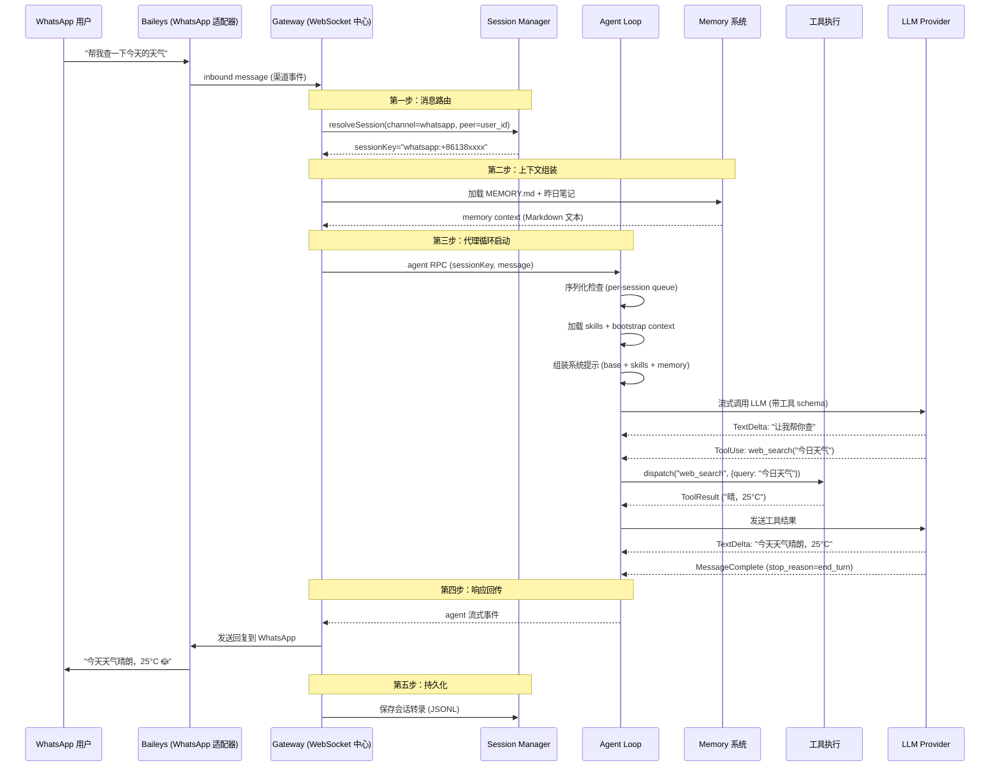
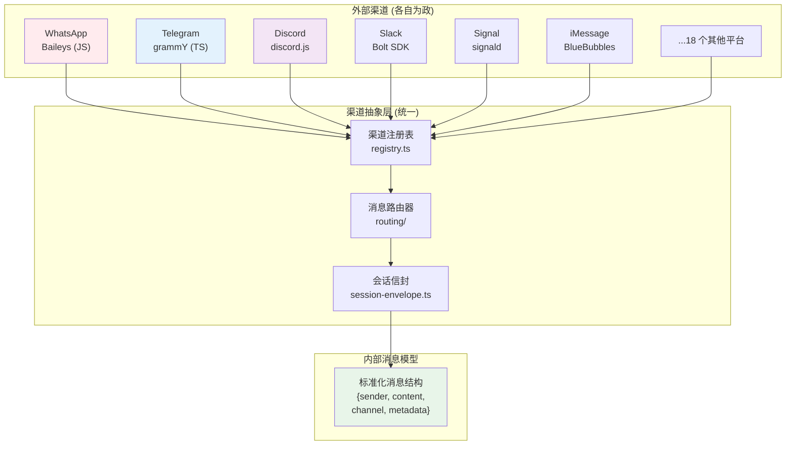
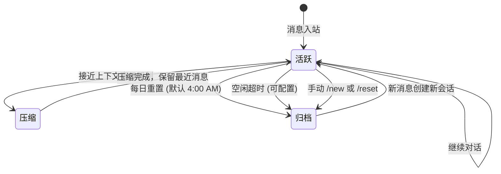
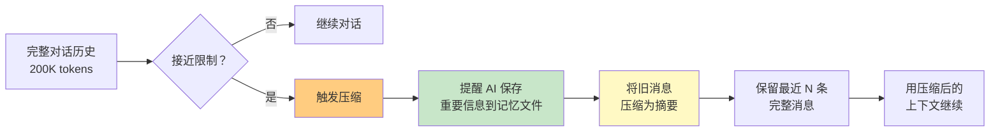
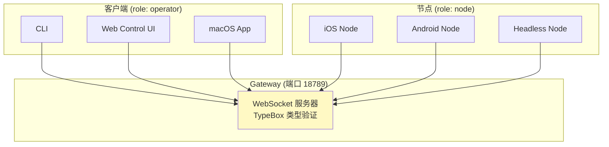
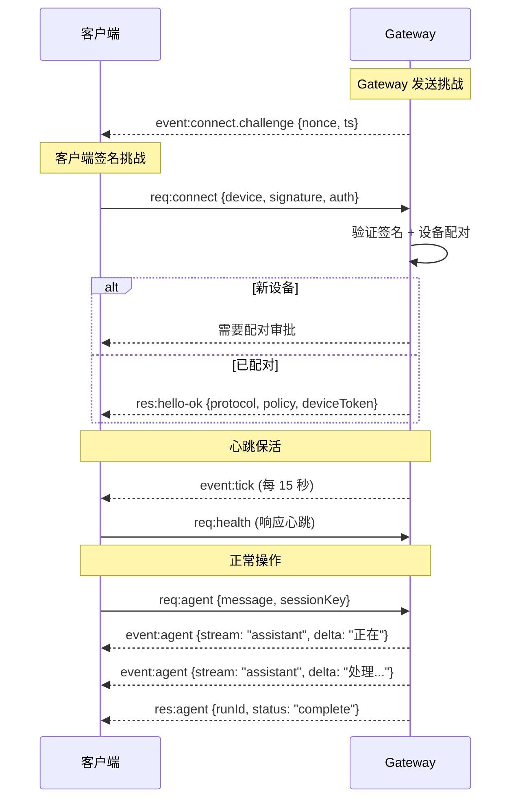
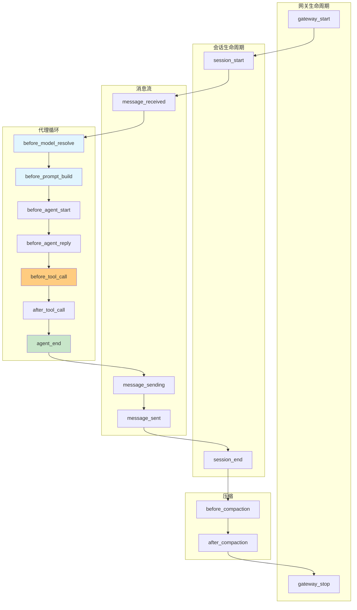

# OpenClaw 架构深度解析

> **EXFOLIATE! EXFOLIATE!**  
> 一条消息穿过 24 个聊天平台的旅程，和一个"个人 AI 网关"的设计哲学  
> 版本：v2026.4.x | 分析时间：2026-04-13

---

## 开场：为什么需要 OpenClaw？

> **问题：** 你有一个 AI 助手。但它在 Discord 上是一个机器人，在 WhatsApp 上是另一个，在 Telegram 上又是第三个。每个都有独立的会话、独立的记忆、独立的认证。你想让它帮你执行任务 —— 但它连你的文件系统都碰不到。

> **更糟的是：** 你用的是闭源托管服务。你的聊天历史、你的文件、你的 API 密钥 —— 全在别人的服务器上。

**OpenClaw 的回答：**

> **一个 Gateway，所有渠道，你的硬件，你的规则。**

OpenClaw 是一个 **自托管的个人 AI 助手网关**。你在一台机器上运行一个进程，它能同时连接 WhatsApp、Telegram、Discord、Slack、Signal、iMessage、Microsoft Teams、Matrix、Google Chat、LINE、WeChat 等 24+ 平台。它能执行 shell 命令、读写文件、访问浏览器、控制 macOS/iOS/Android 设备。它记得你们之前聊过什么 —— 用你看得见、改得了的 Markdown 文件。

**如果没有它，你会失去什么？**

| 痛点 | 现状 | OpenClaw 的方案 |
|------|------|----------------|
| **渠道碎片化** | 每个平台写一个 bot | 一个 Gateway 服务所有渠道 |
| **会话不连续** | 跨渠道对话从零开始 | 统一会话路由，跨渠道身份链接 |
| **数据失控** | 托管服务拥有你的数据 | 自托管，一切在本地 |
| **工具受限** | 只能调用预定义 API | shell、文件、浏览器、MCP、自定义插件 |
| **记忆黑盒** | 不知道 AI "记住"了什么 | 明文 Markdown 文件，可搜索可编辑 |

---

## 主线：一条消息的完整旅程

让我们跟随一条真实的 WhatsApp 消息，看看 OpenClaw 内部发生了什么。

**场景：** 用户在 WhatsApp 上发送 "帮我查一下今天的天气"



**旅程中的五个关键站点，也是 OpenClaw 架构的五个支柱：**

1. **渠道抽象** —— 24+ 平台的统一消息模型
2. **会话管理** —— 跨渠道的身份路由与隔离
3. **代理循环** —— 上下文组装、LLM 调用、工具执行的序列化
4. **记忆系统** —— 基于 Markdown 的持久化记忆
5. **Gateway 协议** —— 所有组件的通信骨干

接下来，逐个拆解。

---

## 机制一：渠道抽象层 —— 24 种语言的翻译官

### TL;DR
> OpenClaw 用一个 **统一的内部消息模型** 对接 24+ 聊天平台。每个平台有独立的适配器（Baileys 对接 WhatsApp、grammY 对接 Telegram 等），但进入 Gateway 后，所有消息都变成同一个形状。

### 渠道适配器的现实



**每个渠道适配器必须实现的核心接口：**

```typescript
interface ChannelAdapter {
  // 发送消息到渠道
  send(message: OutboundMessage): Promise<void>;

  // 监听入站消息
  onMessage(handler: (msg: InboundMessage) => void): void;

  // 渠道特定的状态管理
  getAccountSnapshot(): Promise<AccountSnapshot>;

  // 类型指示器（"对方正在输入..."）
  showTyping(threadId: string): Promise<void>;
}
```

### 为什么不用统一 SDK？

| 方案 | 优势 | 劣势 | OpenClaw 选择 |
|------|------|------|--------------|
| **统一 SDK**（如 Botpress） | 一处编写，处处运行 | 抽象泄漏、功能受限、版本锁定 | ❌ |
| **独立适配器** | 每个渠道用最佳库、功能完整 | 维护成本高、行为不一致 | ✅ |
| **MCP 桥接** | 标准化、解耦 | 延迟高、不适合实时聊天 | ❌（用于工具，不用于渠道） |

> **决策理由：** 聊天渠道的 API 差异太大。WhatsApp 用 Baileys（逆向工程），Telegram 用官方 Bot API，iMessage 需要 BlueBubbles 中间层。强行统一只会得到一个"最小公分母"。OpenClaw 选择**在消息入站后才统一格式** —— 适配器层可以各显神通。

### 工程真实感：渠道适配器的脆弱性

```typescript
// 真实问题：WhatsApp (Baileys) 的认证令牌会过期
// 需要在渠道层处理重连，而不是让 Gateway 崩溃

class WhatsAppChannel implements ChannelAdapter {
  private client: WASocket;

  async init() {
    this.client = makeWASocket({
      auth: await this.loadAuthState(),
    });

    // 断线重连逻辑
    this.client.ev.on('connection.update', async (update) => {
      const { connection, lastDisconnect } = update;
      if (connection === 'close') {
        const shouldReconnect =
          (lastDisconnect?.error as any)?.output?.statusCode !== 401;
        if (shouldReconnect) {
          this.logger.warn('WhatsApp disconnected, reconnecting...');
          await this.init(); // 递归重连
        } else {
          this.logger.error('WhatsApp auth revoked, need re-pairing');
          // 通知 Gateway 该渠道不可用
        }
      }
    });
  }
}
```

**失败场景：**

| 渠道 | 典型失败 | 影响范围 | 恢复策略 |
|------|---------|---------|---------|
| WhatsApp | 认证过期（401） | 单渠道 | 需要用户重新扫码 |
| Telegram | API 限流 | 单渠道 | 指数退避重试 |
| Discord | Bot 令牌失效 | 单渠道 | 通知用户更新配置 |
| iMessage | BlueBubbles 离线 | 单渠道 | 渠道降级，其他渠道不受影响 |

> **关键设计：** 渠道隔离意味着一个渠道崩溃不影响其他渠道。这是 Gateway 架构的核心优势。

---

## 机制二：会话管理 —— 跨渠道的身份迷宫

### TL;DR
> 会话是 OpenClaw 的**对话容器**。核心难题是：同一个人在 WhatsApp 和 Telegram 上发消息，应该共享一个会话还是分开？OpenClaw 用**可配置的作用域策略**解决这个问题。

### 会话路由决策树

```mermaid
flowchart TB
  A[消息入站] --> B{消息来源}

  B -->|DM 私信 | C{DM 作用域配置}
  B -->|群聊 | D[每群独立会话]
  B -->|Cron 定时任务 | E[每次运行新会话]
  B -->|Webhook | F[每 Hook 独立会话]

  C -->|main (默认) | G[所有 DM 共享一个会话]
  C -->|per-peer | H[按发送者隔离]
  C -->|per-channel-peer | I[按渠道 + 发送者隔离 ★]
  C -->|per-account-channel-peer | J[按账号 + 渠道 + 发送者隔离]

  style G fill:#fff9c4
  style H fill:#fff9c4
  style I fill:#c8e6c9
  style J fill:#e1f5fe
```

### 身份链接：跨渠道的"同一人"识别

```json5
// openclaw.json
{
  session: {
    identityLinks: [
      {
        // Alice 在 WhatsApp 和 Telegram 上是同一个人
        identities: ["whatsapp:+86138xxxx", "telegram:12345678"],
        sessionKey: "alice-unified"
      }
    ]
  }
}
```

**为什么这是难点？**

```
场景：Bob 通过 WhatsApp 给你发消息
     → 会话 A（WhatsApp: +1234）

     Bob 又通过 Telegram 给你发消息
     → 如果没有 identityLinks → 会话 B（Telegram: 5678）
     → 如果有 identityLinks     → 会话 A（共享历史）

     问题：AI 是否应该知道 Bob 在两个渠道上说过什么？
     答案：取决于用户配置。OpenClaw 不替你做决定。
```

### 会话生命周期



**会话存储结构：**

```
~/.openclaw/agents/<agentId>/sessions/
├── sessions.json              # 会话元数据（键、创建时间、最后活跃）
├── <sessionId>.jsonl          # 转录文件（每行一条消息/工具调用）
└── compacted/
    └── <sessionId>.jsonl      # 压缩后的历史
```

### 设计权衡：为什么用 JSONL 而不是数据库？

| 方案 | 优势 | 劣势 | OpenClaw 选择 |
|------|------|------|--------------|
| **SQLite** | 查询高效、事务安全 | 增加依赖、调试不透明 | ❌（用于记忆，不用于转录） |
| **JSONL** | 追加写入、人类可读、易于备份 | 随机访问慢、需要外部索引 | ✅ |
| **内存** | 最快 | 重启丢失 | ❌ |

> **决策理由：** 转录文件是**追加写入**的（新消息只追加到末尾），JSONL 的写入模式完美匹配。而且开发者可以直接 `tail -f` 查看实时对话 —— 这种透明度对调试至关重要。

---

## 机制三：代理循环 —— 上下文组装的艺术

### TL;DR
> 代理循环是 OpenClaw 的**核心引擎**。它不是简单的"发消息 → 等回复"，而是一个精心编排的**序列化管道**：上下文组装 → 系统提示构建 → LLM 流式调用 → 工具执行 → 响应回传 → 持久化。

### 代理循环的完整生命周期

```mermaid
flowchart TB
  subgraph "准备阶段"
    P1["解析会话密钥"]
    P2["获取会话写锁"]
    P3["加载 skills 快照"]
    P4["解析 bootstrap 文件"]
    P5["加载记忆 (MEMORY.md + 笔记)"]
  end

  subgraph "提示词组装"
    P6["构建系统提示<br/>base + skills + memory + context"]
    P7["计算 token 预算<br/>预留压缩空间"]
  end

  subgraph "LLM 调用"
    P8["流式调用 LLM<br/>带工具 schema"]
    P9["处理 TextDelta<br/>实时推送到渠道"]
    P10{stop_reason}
  end

  subgraph "工具执行"
    P11["解析 tool_use"]
    P12["权限检查"]
    P13["执行工具"]
    P14["结果注入消息历史"]
    P14 --> P8
  end

  subgraph "完成阶段"
    P15["发送最终回复到渠道"]
    P16["保存会话转录"]
    P17["释放会话写锁"]
    P18["触发 agent_end Hook"]
  end

  P1 --> P2 --> P3 --> P4 --> P5 --> P6 --> P7 --> P8 --> P9 --> P10
  P10 -->|tool_use| P11 --> P12 --> P13 --> P14
  P10 -->|end_turn| P15 --> P16 --> P17 --> P18 --> [*]
```

### 序列化：为什么同一会话不能并发运行？

```typescript
// 伪代码：代理循环的序列化逻辑
class AgentLoop {
  private sessionQueues = new Map<string, PQueue>();

  async runAgent(params: AgentParams) {
    const queue = this.sessionQueues.get(params.sessionKey)
      ?? this.createSessionQueue(params.sessionKey);

    return queue.add(async () => {
      // 获取会话写锁
      const lock = await this.sessionManager.acquireWriteLock(params.sessionKey);

      try {
        return await this.executeAgentLoop(params, lock);
      } finally {
        lock.release();
      }
    });
  }
}
```

**为什么必须序列化？**

```
场景：用户同时发送两条消息到同一个 WhatsApp 会话

如果不序列化：
  请求 A: 读取消息历史 → [msg1, msg2]
  请求 B: 读取消息历史 → [msg1, msg2]  (相同！)
  请求 A: 写入回复 A
  请求 B: 写入回复 B  (覆盖了 A 的上下文！)

如果序列化：
  请求 A: 读取 → [msg1, msg2] → 写入回复 A
  请求 B: 读取 → [msg1, msg2, reply_A] → 写入回复 B (包含 A 的上下文)
```

> **类比：** 就像数据库的写锁。多个读可以并发，但写必须排队，否则会丢失更新。

### 上下文组装：系统提示的"配方"

```
系统提示 = 基础提示 (OpenClaw 默认)
         + 技能提示 (按需加载的 SKILL.md)
         + 记忆内容 (MEMORY.md + 昨日笔记)
         + Bootstrap 文件 (AGENTS.md, SOUL.md, USER.md)
         + 运行时上下文 (渠道信息、发送者身份、时间)
```

**Token 预算管理：**

```
总上下文窗口: 200,000 tokens (Claude)

分配策略:
  系统提示:     ~3,000 tokens (1.5%)
  消息历史:    ~150,000 tokens (75%)
  工具结果:     ~20,000 tokens (10%)
  压缩预留:     ~27,000 tokens (13.5%)
```

### 压缩（Compaction）：对话的"有损压缩"



**压缩的巧妙设计：**

1. **压缩前提醒 AI 保存记忆** —— 防止重要信息丢失
2. **工具调用和结果保持配对** —— 不拆散 `tool_use` 和 `tool_result`
3. **可用不同模型做压缩** —— 主模型用小模型，压缩用大模型
4. **插件化压缩提供者** —— 可以替换压缩逻辑

```json5
{
  "agents": {
    "defaults": {
      "compaction": {
        // 用更强大的模型做压缩，主模型可以便宜
        "model": "openrouter/anthropic/claude-sonnet-4-6"
      }
    }
  }
}
```

---

## 机制四：记忆系统 —— 明文 Markdown 的哲学

### TL;DR
> OpenClaw 的记忆不是向量数据库里的黑盒 embedding，而是**你看得见、改得了的 Markdown 文件**。AI 只"记住"被写入磁盘的内容 —— 没有隐藏状态。

### 记忆文件结构

```
~/.openclaw/workspace/
├── MEMORY.md              # 长期记忆 (每次 DM 会话开始加载)
├── DREAMS.md              # 梦境日记 (实验性，AI 的"潜意识"整理)
└── memory/
    ├── 2026-04-13.md      # 今日笔记 (自动加载)
    ├── 2026-04-12.md      # 昨日笔记 (自动加载)
    └── 2026-04-11.md      # 前日笔记 (按需搜索)
```

**MEMORY.md 示例：**

```markdown
## 用户资料
- 名字：艾力
- 偏好：TypeScript > Python
- 时区：Asia/Shanghai

## 关键决策
- 2026-04-10: 选择 OpenClaw 作为个人 AI 助手基座
- 2026-04-12: 配置 WhatsApp + Telegram 双渠道

## 经验教训
- WhatsApp 认证令牌每 30 天过期，需要重新扫码
- 压缩前 AI 会自动保存重要信息，但仍建议手动确认
```

### 记忆工具

```typescript
// AI 可用的记忆工具
interface MemoryTools {
  // 语义搜索 + 关键词混合搜索
  memory_search(query: string): Promise<MemorySnippet[]>;

  // 读取特定文件/行范围
  memory_get(path: string, lines?: [number, number]): Promise<string>;
}
```

**混合搜索的工作原理：**

```
查询："用户喜欢什么编程语言"

向量搜索 (语义):  找到 "偏好：TypeScript > Python"
                  (语义相似度高)

关键词搜索 (精确): 找到 "TypeScript", "Python"
                  (精确匹配代码符号)

混合结果: 两者结合，排序后返回
```

> **为什么混合搜索？** 向量搜索擅长语义理解但会漏掉精确的代码符号（如 `sessionId`、`agentId`）。关键词搜索正好相反。两者结合才是完整方案。

### 记忆 Wiki 插件

如果纯笔记不够，`memory-wiki` 插件提供了更结构化的知识管理：

```
memory-wiki 的功能:
├── 确定性页面结构
├── 结构化声明和证据
├── 矛盾和新鲜度跟踪
├── 生成的仪表板
└── wiki 原生工具 (wiki_search, wiki_get, wiki_apply, wiki_lint)
```

### 设计权衡：为什么不用向量数据库？

| 方案 | 优势 | 劣势 | OpenClaw 选择 |
|------|------|------|--------------|
| **向量数据库**（Pinecone/Weaviate） | 大规模、高性能 | 外部依赖、调试困难、成本高 | ❌ |
| **SQLite + 向量扩展** | 本地、无外部依赖 | 需要编译扩展、平台兼容性问题 | ✅ (内置记忆后端) |
| **纯 Markdown 文件** | 人类可读、可 Git 管理 | 搜索慢、无结构化查询 | ✅ (默认) |
| **混合** | 兼顾 | 复杂度最高 | ✅ (推荐) |

> **哲学选择：** OpenClaw 坚持**透明度优先**。记忆是明文文件，用户可以随时查看、编辑、回滚。向量数据库是一个黑盒 —— 你不知道 AI "记住"了什么，也不知道为什么检索到某条结果。

---

## 机制五：Gateway 协议 —— WebSocket 的中央枢纽

### TL;DR
> 所有组件（CLI、Web UI、macOS App、iOS/Android 节点）都通过 **同一个 WebSocket 协议** 连接到 Gateway。这不是 REST API，而是一个定制的、类型安全的、基于 TypeBox 的 RPC 协议。

### 协议架构



### 连接生命周期



### 为什么用 WebSocket 而不是 REST？

| 方案 | 优势 | 劣势 | OpenClaw 选择 |
|------|------|------|--------------|
| **REST + 轮询** | 简单、通用 | 实时性差、连接开销大 | ❌ |
| **REST + SSE** | 服务端推送 | 单向、不适合 RPC | ❌ |
| **gRPC** | 高性能、强类型 | 需要 Protobuf、浏览器支持差 | ❌ |
| **WebSocket** | 双向实时、JSON 友好 | 需要自定义协议 | ✅ |

> **决策理由：** OpenClaw 需要**双向实时通信**。LLM 的流式响应需要实时推送到客户端，客户端也需要随时发送控制命令（如 `/stop`）。WebSocket 是唯一同时满足双向、实时、浏览器友好的方案。

### 协议类型安全：TypeBox 的魔力

```typescript
// TypeBox 定义协议类型
const ConnectParams = Type.Object({
  minProtocol: Type.Number(),
  maxProtocol: Type.Number(),
  client: Type.Object({
    id: Type.String(),
    version: Type.String(),
    platform: Type.String(),
  }),
  role: Type.Union([
    Type.Literal('operator'),
    Type.Literal('node'),
  ]),
  device: Type.Object({
    id: Type.String(),
    publicKey: Type.String(),
    signature: Type.String(),
    nonce: Type.String(),
  }),
});

// 自动生成 JSON Schema 用于验证
const schema = Type.Strict(ConnectParams);

// 自动生成 Swift 模型用于 iOS 客户端
// (通过 JSON Schema → Swift codegen)
```

> **TypeBox 的价值：** 一份类型定义 → JSON Schema（运行时验证） → Swift 模型（iOS 客户端） → TypeScript 类型（Gateway）。避免了三套代码的手动同步。

---

## 机制六：插件系统 —— 生命周期拦截点

### TL;DR
> OpenClaw 的插件系统不是"添加功能"，而是**在代理和网关生命周期的每个关键点插入自定义逻辑**。从模型解析到提示词构建，从工具调用到会话结束，都有对应的 Hook 点。

### Hook 点全景图



### Hook 决策规则

```typescript
// before_tool_call 的拦截逻辑
interface ToolCallHookResult {
  block?: boolean;    // 阻止工具调用
  modify?: object;    // 修改工具参数
  bypass?: boolean;   // 跳过工具，返回合成结果
}

// 处理链：多个 Hook 按优先级执行
// block: true 是终态的，阻止低优先级 handler
// block: false 是无操作的，不清除之前的 block
```

### 真实用例：出站消息审查

```typescript
// 插件示例：在消息发送前进行安全审查
plugin.hooks.on('message_sending', async (ctx) => {
  const content = ctx.message.content;

  // 检查是否包含敏感信息
  if (containsPii(content)) {
    return { block: true, reason: 'Message contains PII' };
  }

  // 或者修改消息
  if (containsInternalUrls(content)) {
    ctx.message.content = redactUrls(content);
    return { modify: ctx.message };
  }
});
```

### 设计权衡：内部 Hook vs 插件 Hook

| 类型 | 触发位置 | 能力 | 复杂度 |
|------|---------|------|-------|
| **内部 Hook** (Gateway hooks) | 网关命令和生命周期事件 | 执行脚本、修改命令行为 | 低 |
| **插件 Hook** | 代理循环和网关管道内部 | 拦截模型解析、提示词构建、工具调用 | 高 |

> **设计哲学：** 内部 Hook 是**运维层面**的（日志、通知、简单拦截），插件 Hook 是**开发层面**的（改变代理行为、注入上下文）。两者互补，不是替代关系。

---

## 技术选型对比

### 为什么选 TypeScript 而不是 Python？

```
OpenClaw 的自我解释：
"OpenClaw is primarily an orchestration system: prompts, tools, protocols, and integrations.
TypeScript was chosen to keep OpenClaw hackable by default.
It is widely known, fast to iterate in, and easy to read, modify, and extend."
```

| 维度 | TypeScript | Python | 对 OpenClaw 的影响 |
|------|-----------|--------|-------------------|
| **生态系统** | npm 有所有渠道的 JS SDK | pip 有 ML 库但缺渠道 SDK | TS 赢在渠道集成 |
| **类型安全** | 编译时类型检查 | 运行时类型检查（可选） | TS 减少协议错误 |
| **异步模型** | Promise/async-await | asyncio | 两者相当 |
| **开发者基数** | 前端开发者都能参与 | AI 工程师熟悉 | TS 更"hackable" |
| **性能** | V8 引擎，足够快 | C 扩展快但纯 Python 慢 | TS 足够（主要是 I/O 密集型） |

> **诚实的缺点：** TypeScript 的生态在 AI/ML 领域不如 Python。如果 OpenClaw 要做本地模型推理，Python 会是更好的选择。但 OpenClaw 的定位是**编排系统**，不是计算引擎 —— 模型调用走 API，本地只做协调。

### 单 Gateway vs 多 Gateway

| 方案 | 优势 | 劣势 | OpenClaw 选择 |
|------|------|------|--------------|
| **单 Gateway** | 会话一致性、简单部署、无分布式协调 | 单点故障、垂直扩展受限 | ✅ (默认) |
| **多 Gateway** | 水平扩展、高可用 | 会话同步复杂、分布式锁、脑裂风险 | ❌ (但支持多 Gateway 读模式) |
| **无服务器** | 按需扩展、免运维 | 冷启动延迟、状态管理复杂 | ❌ |

> **决策理由：** OpenClaw 的定位是**个人助手**，不是企业级服务。单 Gateway 满足了 99% 的场景，而且部署简单。对于需要高可用的场景，可以通过外部工具（systemd、launchd）实现进程级重启。

---

## 异常与边界处理

### 失败场景分析

**1. 渠道断线：**

```
问题：WhatsApp (Baileys) 的认证令牌每 30 天过期
影响：单渠道不可用，其他渠道正常
处理：
  - 渠道适配器检测到 401 错误
  - 标记渠道为 "unavailable"
  - 通知用户需要重新扫码
  - Gateway 继续服务其他渠道
```

**2. LLM 超时：**

```
问题：模型 API 响应超时（网络问题或服务端过载）
影响：当前会话的代理循环卡住
处理：
  - 可配置的超时阈值
  - 超时后中止当前 run
  - 释放会话写锁
  - 用户可以重试
```

**3. 会话膨胀：**

```
问题：长期运行的会话导致 JSONL 文件过大
影响：磁盘空间、加载速度
处理：
  - 自动压缩（接近上下文窗口限制时）
  - 会话维护（可配置清理策略）
  - openclaw sessions cleanup --dry-run 预览
```

**4. 上下文窗口溢出：**

```
问题：对话历史超过模型的最大 token 数
影响：模型拒绝处理
处理：
  - 自动检测溢出错误签名
  - 压缩旧消息
  - 用压缩后的上下文重试
  - 可用不同模型做压缩（大模型总结，小模型对话）
```

### 安全边界

```
信任模型：
┌─────────────────────────────────────┐
│           外部世界                  │
│  (WhatsApp, Telegram, 用户消息)      │
├─────────────────────────────────────┤
│     Gateway 协议验证                │
│  (签名、设备配对、共享密钥)          │
├─────────────────────────────────────┤
│     渠道隔离                        │
│  (一个渠道崩溃不影响其他)            │
├─────────────────────────────────────┤
│     代理循环                        │
│  (会话写锁、序列化执行)              │
├─────────────────────────────────────┤
│     工具执行                        │
│  (权限检查、沙箱隔离)               │
├─────────────────────────────────────┤
│           本地资源                  │
│  (文件系统、shell、MCP)             │
└─────────────────────────────────────┘
```

> **关键安全设计：** OpenClaw 默认在本地回环地址 (`127.0.0.1:18789`) 上绑定 Gateway。远程访问需要 Tailscale 或 SSH 隧道。这不是限制，而是** deliberate security posture** —— 默认安全，显式开放。

---

## 扩展点地图

```
扩展复杂度从低到高：

Level 1: 添加 Markdown 技能     (~50 行)          🟢 低风险
         ↓
Level 2: 配置 Gateway Hook     (~20 行脚本)       🟢 低风险
         ↓
Level 3: 编写插件              (~150 行 TS)       🟡 中风险
         ↓
Level 4: 添加渠道适配器        (~300 行 TS)       🟡 中风险
         ↓
Level 5: 添加记忆后端         (~500 行 TS)       🟠 高风险
         ↓
Level 6: 修改代理循环核心     (~1000 行 TS)      🔴 高风险
```

---

## 批判性分析：OpenClaw 的局限

**1. 单 Gateway 的扩展瓶颈**

当渠道数量超过 20+ 且消息频率很高时，单进程 Node.js 的 Event Loop 可能成为瓶颈。这不是理论问题 —— 在高并发场景下，WebSocket 连接的维护和 JSON 解析会消耗大量 CPU。

**缓解方案：** 使用 `--install-daemon` 部署为系统服务，利用多核机器（但单进程仍只用一个核）。

**2. 渠道适配器的维护负担**

24+ 渠道 = 24+ 个第三方库的依赖管理。当 Baileys 升级、grammY 改 API、discord.js 换版本时，OpenClaw 必须同步更新。这是一个持续的维护成本。

**3. 记忆的"手动"本质**

Markdown 记忆文件透明，但需要 AI 主动写入。如果 AI "忘记"保存重要信息，压缩后就会丢失。虽然压缩前会提醒 AI 保存，但这依赖于 AI 的配合 —— 不是一个强保证。

**4. TypeScript 的类型运行时开销**

TypeBox 的类型验证在每次 WebSocket 消息时都运行。对于高频消息（如 typing indicators），这可能引入不必要的开销。

---

## 总结：OpenClaw 的本质

> **OpenClaw 不是一个"聊天机器人框架"。它是一个"个人 AI 基础设施"。**

它的核心价值在于：

1. **渠道聚合** —— 一个 Gateway 服务 24+ 平台，消除碎片化
2. **透明记忆** —— 明文 Markdown，没有黑盒
3. **安全默认** —— 本地绑定、设备配对、渠道隔离
4. **可扩展性** —— 插件 Hook 系统覆盖每个生命周期节点
5. **自托管哲学** —— 你的硬件、你的数据、你的规则

**它适合谁？**

- 想要一个**真正私人**的 AI 助手的开发者
- 需要在**多个聊天平台**统一管理 AI 交互的团队
- 希望**完全控制** AI 工具权限和安全边界的安全意识用户

**它不适合谁？**

- 需要开箱即用的非技术用户（需要 Node.js、配置、维护）
- 需要企业级高可用和水平扩展的场景（单 Gateway 架构限制）
- 需要本地模型推理的场景（定位是编排，不是计算）

正如项目精神所言：

> **EXFOLIATE! EXFOLIATE!**

剥开闭源的黑盒，露出透明的、可控制的、属于你的 AI 助手。

---

*© 2026 OpenClaw 技术架构解析 | 基于 MIT 协议开源*
