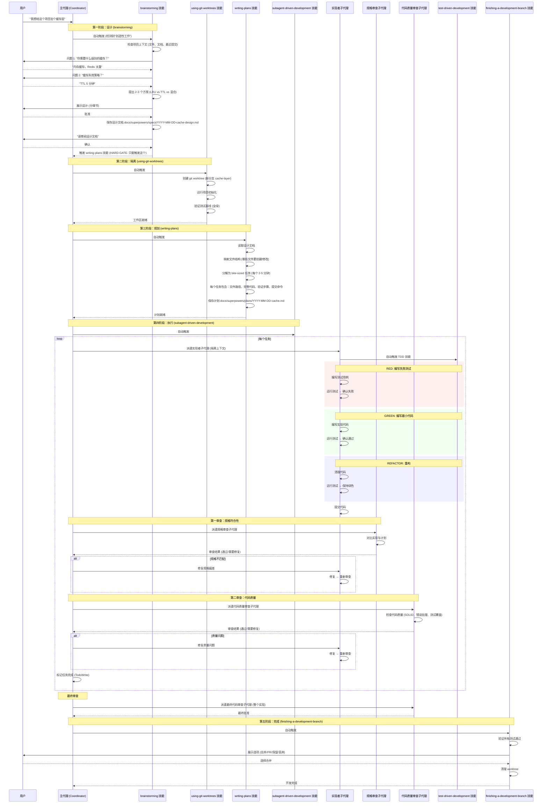
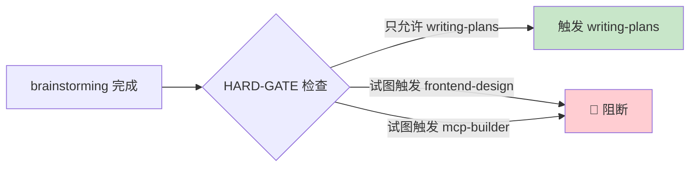
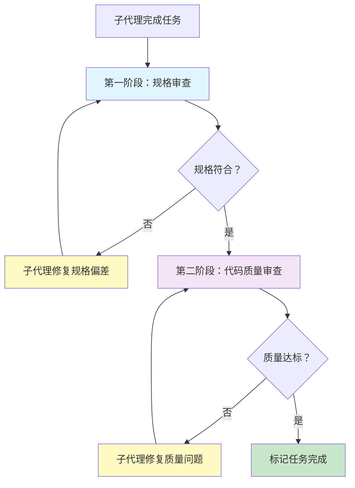
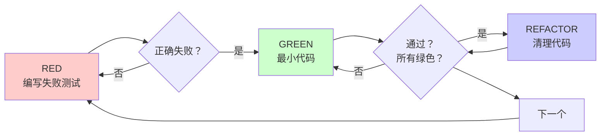
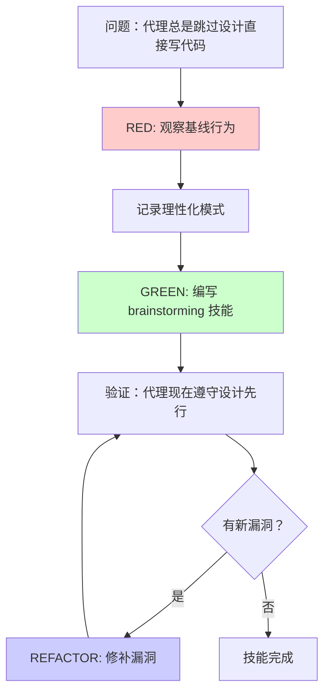
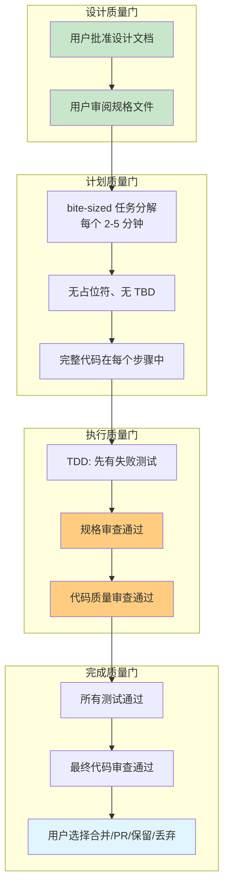
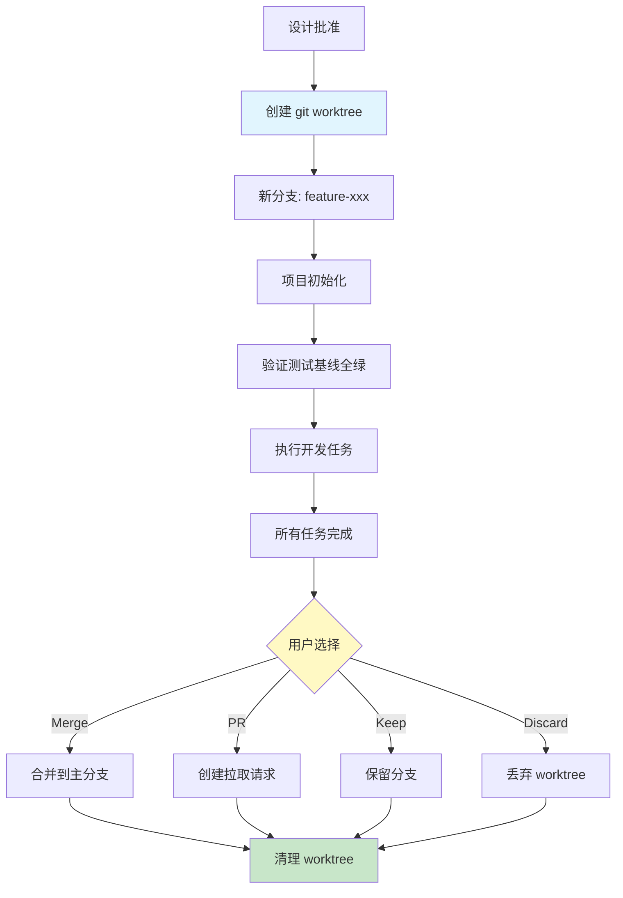

# SuperPowers 架构深度解析

> **让 AI 编程代理从"打字机"变成"工程师"**  
> 一个创意变成可合并代码的完整旅程，和一套"技能即代码"的编排哲学  
> 分析时间：2026-04-13

---

## 开场：AI 编程代理的"兴奋病"

> **场景：** 你对 Claude Code 说"帮我加个用户认证功能"。  
> **30 秒后：** 它已经在写代码了。  
> **30 分钟后：** 代码写完了，但你发现 —— 它没有问你用什么认证方式、没有考虑现有架构、没有写测试、直接在 main 分支上改、而且实现的是它猜你想要的需求，不是你真想要的。

这就是 AI 编程代理的 **"兴奋病"** —— 拿到需求立刻写代码，跳过所有软件工程的基本原则：设计评审、需求确认、测试先行、代码审查、分支隔离。

**SuperPowers 的回答：**

> **给 AI 代理一套"技能库" + "强制流程"。不是告诉它怎么做，而是确保它在做之前先想清楚。**

SuperPowers 不是一个新的编程框架，不是一个新的 IDE 插件，不是一个新的 LLM。它是一套 **composable skills 系统** —— 14 个可组合的技能文件，每个都是一个 Markdown 文档，共同定义了一个完整的软件开发生命周期：

```
brainstorming → using-git-worktrees → writing-plans → subagent-driven-development
    → test-driven-development → requesting-code-review → finishing-a-development-branch
```

**如果没有它，你会失去什么？**

| 痛点 | 现状 | SuperPowers 的方案 |
|------|------|-------------------|
| **AI 直接写代码** | 没有设计评审、需求确认 | brainstorming 技能强制设计先行 |
| **在 main 分支上乱改** | 污染主分支 | git worktree 隔离 |
| **先写代码后补测试** | 测试形同虚设 | TDD "铁律"：没有失败测试就没有生产代码 |
| **没人审查 AI 写的代码** | AI 自己写自己审 | 两阶段审查（规格符合性 + 代码质量） |
| **技能之间不衔接** | 手动触发、容易遗漏 | 自动触发机制，技能之间通过 HARD-GATE 衔接 |

---

## 主线：一个创意变成可合并代码的完整旅程

让我们跟随一个真实的开发任务，看看 SuperPowers 内部发生了什么。

**场景：** 用户说 "我想给这个项目加个缓存层"



**旅程中的五个阶段，也是 SuperPowers 的五个核心机制：**

1. **brainstorming** —— 把模糊创意变成可执行设计
2. **writing-plans** —— 把设计分解为 bite-sized 任务
3. **subagent-driven-development** —— 用子代理隔离执行 + 两阶段审查
4. **test-driven-development** —— RED-GREEN-REFACTOR 铁律
5. **finishing-a-development-branch** —— 质量门控 + 合并决策

接下来，逐个拆解这些机制，以及支撑它们的底层架构。

---

## 机制一：技能系统 —— "Markdown 即流程代码"

### TL;DR
> SuperPowers 的技能不是"文档"，而是**可执行的流程定义**。每个技能是一个 SKILL.md 文件，包含 YAML frontmatter（触发条件）+ Markdown 正文（执行步骤）。代理在每次任务前自动检查并触发相关技能。

### 技能文件格式

```yaml
---
name: brainstorming
description: "You MUST use this before any creative work - creating features, building components, adding functionality, or modifying behavior. Explores user intent, requirements and design before implementation."
---
```

```markdown
# Brainstorming Ideas Into Design

## Checklist
1. Explore project context
2. Offer visual companion
3. Ask clarifying questions (one at a time)
4. Propose 2-3 approaches
5. Present design sections
6. Write design doc
7. Spec self-review
8. User reviews written spec
9. Transition to implementation → invoke writing-plans

<HARD-GATE>
Do NOT invoke any implementation skill until user has approved design.
</HARD-GATE>
```

**关键设计：**

| 元素 | 作用 | 类比 |
|------|------|------|
| **`name`** | 技能唯一标识，用于跨技能引用 | 函数名 |
| **`description`** | 触发条件，告诉代理"什么时候用" | 函数注释 |
| **Checklist** | 执行步骤，代理必须按顺序完成 | 函数体 |
| **`<HARD-GATE>`** | 强制门控，阻止代理跳过流程 | 断言/前置条件 |

### 技能如何被触发？

```
触发方式 1：自动匹配
  代理在每次任务前，检查当前上下文是否匹配某个技能的 description
  匹配 → 自动激活

触发方式 2：显式调用
  用户在聊天中说 "help me plan this feature"
  代理识别到"规划"意图 → 激活 brainstorming

触发方式 3：技能间调用
  brainstorming 完成后，通过 HARD-GATE 强制触发 writing-plans
  这是技能链的核心衔接机制
```

### 14 个技能的全景图

```mermaid
flowchart TB
  subgraph "设计阶段"
    BS["brainstorming<br/>设计评审"]
    VC["visual-companion<br/>可视化辅助"]
  end

  subgraph "准备阶段"
    GW["using-git-worktrees<br/>分支隔离"]
    WP["writing-plans<br/>任务分解"]
  end

  subgraph "执行阶段"
    SDD["subagent-driven-development<br/>子代理执行"]
    EP["executing-plans<br/>批量执行"]
    TDD["test-driven-development<br/>TDD 铁律"]
    DPA["dispatching-parallel-agents<br/>并行分发"]
  end

  subgraph "审查阶段"
    RC["requesting-code-review<br/>代码审查"]
    RV["receiving-code-review<br/>响应审查"]
  end

  subgraph "调试阶段"
    SD["systematic-debugging<br/>系统调试"]
    VBC["verification-before-completion<br/>完成前验证"]
  end

  subgraph "完成阶段"
    FB["finishing-a-development-branch<br/>合并决策"]
  end

  subgraph "元技能"
    WS["writing-skills<br/>技能编写"]
    US["using-superpowers<br/>系统介绍"]
  end

  BS --> GW --> WP --> SDD
  SDD --> TDD
  SDD --> RC
  RC --> RV
  SD --> VBC
  FB -->[*]

  WS -.-> BS
  WS -.-> WP
  WS -.-> TDD
  WS -.-> SD

  style BS fill:#c8e6c9
  style WP fill:#fff9c4
  style SDD fill:#ffcc80
  style TDD fill:#ffcdd2
  style FB fill:#e1f5fe
```

### 设计权衡：为什么用 Markdown 而不是 JSON/YAML 定义流程？

| 方案 | 优势 | 劣势 | SuperPowers 选择 |
|------|------|------|-----------------|
| **JSON/YAML 流程定义** | 机器可解析、可验证 | 人类不可读、难以迭代 | ❌ |
| **DSL（领域特定语言）** | 精确、可验证 | 学习成本高、生态绑定 | ❌ |
| **Markdown + 约定** | 人类可读、LLM 天然理解、易于编辑 | 需要约定解析规则 | ✅ |

> **核心洞察：** SuperPowers 的执行者是 **LLM**，不是解释器。LLM 天然理解 Markdown 格式，不需要解析器。这是与传统工作流引擎（如 Airflow、GitHub Actions）的本质区别 —— 这里的"运行时"是大语言模型本身。

### 技能的"不可见"约束

```markdown
<!-- 这些是技能的"硬约束"，代理必须遵守 -->

<HARD-GATE>
Do NOT invoke any implementation skill until user has approved design.
</HARD-GATE>

<!-- TDD 的"铁律" -->
NO PRODUCTION CODE WITHOUT A FAILING TEST FIRST

<!-- 调试的"铁律" -->
NO FIXES WITHOUT ROOT CAUSE INVESTIGATION FIRST
```

> **类比：** 这就像编程中的 `assert` —— 不是建议，是**强制条件**。违反它意味着违反了技能的精神，而不仅仅是字面。

---

## 机制二：HARD-GATE —— 技能间的"单向门"

### TL;DR
> HARD-GATE 是 SuperPowers 最精妙的设计之一。它是一个**自定义 XML 标签**，定义了技能之间的强制转换规则。一旦进入某个技能，就不能随意跳到其他技能 —— 必须按照预定义的流程走。

### HARD-GATE 的工作原理



**brainstorming 的 HARD-GATE：**

```markdown
<HARD-GATE>
Do NOT invoke any implementation skill, write any code, scaffold any project,
or take any implementation action until you have presented a design and
the user has approved it.
</HARD-GATE>

<!-- 终端状态 -->
The terminal state is invoking writing-plans.
Do NOT invoke frontend-design, mcp-builder, or any other implementation skill.
The ONLY skill you invoke after brainstorming is writing-plans.
```

**为什么需要 HARD-GATE？**

```
没有 HARD-GATE 的情况：
  brainstorming → 用户批准设计 → 代理兴奋了 → 直接写代码 → 跳过 planning → 跳过 TDD → 跳过审查

有 HARD-GATE 的情况：
  brainstorming → 用户批准设计 → HARD-GATE 生效 → 只能触发 writing-plans → 规划完成 → subagent-driven-development
```

> **类比：** HARD-GATE 就像编译器的**类型系统** —— 它不是运行时检查，而是**结构约束**。它定义了技能之间的"类型签名"，确保流程不被跳过。

### 技能间的"类型签名"

```
brainstorming:
  输入: 用户模糊需求
  输出: 设计文档 (docs/superpowers/specs/YYYY-MM-DD-<topic>-design.md)
  下一个技能: writing-plans (强制)

writing-plans:
  输入: 设计文档
  输出: 实现计划 (docs/superpowers/plans/YYYY-MM-DD-<feature-name>.md)
  下一个技能: subagent-driven-development 或 executing-plans

subagent-driven-development:
  输入: 实现计划
  输出: 每个任务的实现 + 两阶段审查通过
  下一个技能: finishing-a-development-branch

finishing-a-development-branch:
  输入: 所有任务完成
  输出: 合并/PR/保留/丢弃 决策
  下一个技能: 无 (终端状态)
```

### 设计权衡：为什么不用代码实现门控？

| 方案 | 优势 | 劣势 | SuperPowers 选择 |
|------|------|------|-----------------|
| **代码门控**（如中间件） | 强制执行、可验证 | 需要运行时、增加复杂度 | ❌ |
| **约定门控**（HARD-GATE） | 零依赖、LLM 理解、易于维护 | 依赖 LLM 遵守约定 | ✅ |

> **决策理由：** SuperPowers 是"零依赖"设计。它不想依赖任何特定的运行时环境。HARD-GATE 利用 LLM 对自然语言的理解力，用约定代替代码。这在 LLM 代理的上下文中是有效的 —— LLM 被训练遵循指令。

**风险：** 如果 LLM 不遵守 HARD-GATE 怎么办？

```
缓解措施：
1. HARD-GATE 使用自定义 XML 标签，视觉上与普通文本区分
2. 重复强调："The terminal state is invoking writing-plans"
3. 反模式文档："Anti-Pattern: This Is Too Simple To Need A Design"
4. 94% 的 PR 拒绝率 —— 社区维护者是最后一道防线
```

---

## 机制三：子代理驱动开发 —— 隔离上下文的艺术

### TL;DR
> 每个任务派遣一个**全新的子代理**，只给它完成该任务所需的精确上下文。子代理不继承主代理的会话历史，避免"上下文污染"。每个任务完成后，经过**两阶段审查**（规格符合性 + 代码质量）。

### 为什么需要子代理？

```
问题：如果主代理直接执行所有任务

  主代理会话历史:
    Task 1: 缓存接口设计 (5000 tokens)
    Task 2: 缓存实现 (8000 tokens)
    Task 3: 缓存测试 (6000 tokens)
    Task 4: 性能优化 (4000 tokens)
    ...

  结果：上下文窗口爆炸 → 代理开始"遗忘"早期决策 → 质量下降

解决方案：每个任务用独立子代理

  主代理: 协调者 (只保留计划 + 审查结果)
  子代理 1: 只做 Task 1 (隔离上下文)
  子代理 2: 只做 Task 2 (隔离上下文)
  子代理 3: 只做 Task 3 (隔离上下文)

  结果：每个子代理都有完整的上下文窗口用于当前任务
```

### 两阶段审查流程



**第一阶段：规格审查 (Spec Compliance)**

```
审查者子代理检查:
  ✓ 实现是否匹配计划中的描述？
  ✓ 文件路径是否正确？
  ✓ 功能是否完整？
  ✓ 是否有计划外的变更？

审查输出:
  - 通过: 进入第二阶段
  - 不通过: 列出偏差 → 子代理修复 → 重新审查
```

**第二阶段：代码质量审查 (Code Quality)**

```
代码审查者子代理检查:
  ✓ 代码是否遵循 SOLID 原则？
  ✓ 错误处理是否充分？
  ✓ 测试覆盖是否足够？
  ✓ 是否有安全漏洞？
  ✓ 代码组织是否合理？

审查输出:
  - 通过: 任务完成
  - 不通过: 按严重程度分类 (Critical/Important/Suggestion)
    - Critical: 阻止进展，必须修复
    - Important: 应该修复
    - Suggestion: 可选改进
```

### 模型选择策略

```
SuperPowers 不是一刀切地用最贵的模型。它根据任务复杂度选择:

机械实现任务 (1-2 文件，规格明确):
  → 快速、便宜的模型 (如 Claude Haiku)

集成和判断任务 (多文件协调，调试):
  → 标准模型 (如 Claude Sonnet)

架构、设计和审查任务:
  → 最强大的模型 (如 Claude Opus)

这就像一个工程团队:
  - 初级工程师做机械实现
  - 中级工程师做集成
  - 高级工程师做架构和审查
```

### 子代理状态处理

```typescript
// 实现者子代理报告四种状态
enum ImplementerStatus {
  DONE,                  // 完成 → 进入审查
  DONE_WITH_CONCERNS,    // 完成但有疑虑 → 阅读疑虑再决定
  NEEDS_CONTEXT,         // 需要更多上下文 → 提供上下文重新派遣
  BLOCKED,               // 被阻塞 → 评估阻塞原因
}

// 处理 BLOCKED 的决策树
function handleBlocked(blocker: string) {
  if (isContextProblem(blocker)) {
    // 提供上下文，用相同模型重试
    return redispatchSameModel();
  }
  if (needsMoreReasoning(blocker)) {
    // 需要更多推理能力，升级模型
    return redispatchStrongerModel();
  }
  if (taskTooLarge(blocker)) {
    // 任务太大，拆分
    return splitIntoSmallerTasks();
  }
  if (planIsWrong(blocker)) {
    // 计划本身有问题，升级给用户
    return escalateToHuman();
  }
}

// 关键原则：永远不要忽略升级
// "Never ignore an escalation or force the same model to retry without changes."
```

> **类比：** 这就像工程经理处理阻塞 —— 不是简单地"再试一次"，而是分析阻塞原因，采取不同策略。

### 子代理 vs 并行代理

| 特性 | subagent-driven-development | dispatching-parallel-agents |
|------|---------------------------|---------------------------|
| **使用场景** | 执行实现计划 | 多个独立问题同时调试 |
| **执行模式** | 串行，每个任务完成后审查 | 并行，多个子代理同时运行 |
| **审查** | 两阶段（规格 + 质量） | 每个子代理自我审查 |
| **适用任务** | 有依赖关系的任务 | 完全独立的任务 |
| **典型用例** | 功能实现 | 3+ 个测试文件同时失败 |

---

## 机制四：TDD 铁律 —— "没有失败测试就没有生产代码"

### TL;DR
> SuperPowers 的 TDD 不是"建议"，是**铁律**。在写任何生产代码之前，必须先有一个失败的测试。先写代码后补测试？删除它，从头来过。这不是讨论，是规则。

### RED-GREEN-REFACTOR 循环



### "铁律"的强制执行

```markdown
NO PRODUCTION CODE WITHOUT A FAILING TEST FIRST

Write code before the test? Delete it. Start over.

No exceptions:
- Don't keep it as "reference"
- Don't "adapt" it while writing tests
- Don't look at it
Delete means delete.
```

**为什么这么严格？**

```
不严格的情况:
  代理先写代码 → 再"补"测试 → 测试只是代码的镜像 → 测试无法发现错误

严格的情况:
  代理先写测试 → 测试定义期望行为 → 代码只为满足测试而写 → 测试是行为的规范
```

> **类比：** 这就像建筑中的"蓝图先行"。你不能先盖楼再画蓝图 —— 蓝图定义了楼应该是什么样子。

### TDD 在 SuperPowers 中的特殊意义

TDD 不只是测试策略，它是 **SuperPowers 技能编写方法论的基础**。

```
writing-skills 技能的核心思想:
  "Writing skills IS Test-Driven Development applied to process documentation."

TDD 概念映射:
  测试用例     → 压力场景（用子代理模拟）
  生产代码     → 技能文档 (SKILL.md)
  测试失败(RED) → 代理在没有技能时违反规则
  测试通过      → 代理在有技能时遵守规则
  重构         → 修补漏洞，同时保持合规
```

**技能编写的 TDD 流程：**

```
1. RED: 运行基线场景（没有技能），观察代理的理性化行为
2. 记录代理使用的具体理性化方式
3. GREEN: 编写技能文档，针对这些具体违反
4. 验证代理现在遵守规则
5. REFACTOR: 发现新的理性化 → 修补 → 重新验证
```

> **洞察：** SuperPowers 把 TDD 从"代码测试"提升到了"流程测试"的层面。技能文档就是"生产代码"，代理行为就是"测试用例"。

---

## 机制五：技能编写方法论 —— 把流程文档当代码写

### TL;DR
> SuperPowers 最独特的设计是**用 TDD 方法论编写技能文档**。不是"写文档然后希望代理遵守"，而是"先观察代理犯错，再写文档修复这些具体错误，然后验证代理不再犯"。

### 技能 = 测试通过的流程文档



### 技能目录结构

```
skills/
  skill-name/
    SKILL.md              # 主参考 (必需)
    supporting-file.*     # 仅当需要时 (重参考 >100 行)

SKILL.md 结构:
  ---
  name: skill-name
  description: "Use when..."  # 触发条件
  ---

  # 标题
  ## Overview        # 核心原则
  ## When to Use     # 使用时机
  ## The Process     # 执行步骤
  ## Anti-Patterns   # 反模式
  ## Good/Bad 示例   # 对比示例
```

### 技能设计原则

| 原则 | 含义 | 反例 |
|------|------|------|
| **技能是可复用的技术** | 适用于跨项目的模式 | 一次性解决方案 |
| **技能是参考指南** | 有步骤、有模式、有工具 | "我上次怎么解决的"叙事 |
| **技能是行为塑造代码** | 精心调优的内容，不易修改 | 随意重写 |
| **技能是扁平命名空间** | 所有技能在一个可搜索的命名空间 | 嵌套目录结构 |

### 技能的"高修改门槛"

```
SuperPowers 对修改技能内容有极高的门槛:

1. 使用 writing-skills 技能开发和测试
2. 跨多个会话进行对抗性压力测试
3. 在 PR 中展示 before/after 评估结果
4. 不要修改精心调优的内容 (Red Flags 表格、"human partner" 语言等)

原因: "Skills are not prose — they are code that shapes agent behavior."
```

> **类比：** 技能文档就像正则表达式 —— 看起来很简单的字符串，但每个字符都有精确的行为含义。改一个词可能完全改变代理的行为。

---

## 机制六：质量门控链 —— 每个阶段都有检查点

### TL;DR
> SuperPowers 不是在最后才检查质量，而是**在每个阶段都有质量门控**。从设计评审到规格审查到代码质量审查到最终验证，形成了一条不可跳过的质量链。

### 质量门控全景图



### 关键质量门控详解

**门控 1：设计审批 (brainstorming)**

```
检查点:
  ✓ 设计是否分章节展示？
  ✓ 用户是否批准了每个章节？
  ✓ 设计文档是否保存到 specs/ 目录？
  ✓ 用户是否审阅了书面规格？

阻断条件:
  ✗ 用户未批准 → 不能进入 planning
  ✗ 设计文档未保存 → 不能进入 planning
```

**门控 2：计划完整性 (writing-plans)**

```
检查点:
  ✓ 每个任务有精确文件路径？
  ✓ 每个步骤有完整代码？
  ✓ 没有 "TBD"、"TODO"、"implement later"？
  ✓ 每个任务有验证步骤和提交命令？

阻断条件:
  ✗ 有占位符 → 计划不完整
  ✗ 步骤 > 5 分钟 → 任务太大，需要拆分
```

**门控 3：规格符合性 (subagent-driven-development)**

```
检查点:
  ✓ 实现是否匹配计划描述？
  ✓ 文件路径是否正确？
  ✓ 功能是否完整？

阻断条件:
  ✗ 关键偏差 → 阻止进展
  ✗ 计划外变更 → 需要用户确认
```

**门控 4：代码质量 (subagent-driven-development)**

```
检查点:
  ✓ SOLID 原则遵循？
  ✓ 错误处理充分？
  ✓ 测试覆盖足够？
  ✓ 无安全漏洞？

问题分类:
  🔴 Critical: 必须修复，阻止进展
  🟡 Important: 应该修复
  🟢 Suggestion: 可选改进
```

**门控 5：完成决策 (finishing-a-development-branch)**

```
检查点:
  ✓ 所有测试通过？
  ✓ 代码已提交？

用户选项:
  1. Merge (合并到主分支)
  2. Create PR (创建拉取请求)
  3. Keep (保留分支)
  4. Discard (丢弃)
```

### 设计权衡：为什么这么多质量门？

```
传统开发流程:
  写代码 → 测试 → 审查 → 合并 (质量检查在最后)

SuperPowers 流程:
  设计审查 → 计划审查 → 执行审查 (每个阶段) → 规格审查 → 质量审查 → 完成审查

代价: 更多的步骤，更长的前期时间
收益: 更少的返工，更高的代码质量，更少的"惊喜"

类比:
  传统流程: 考完试才知道哪里错了
  SuperPowers: 每学一章就测试一章
```

> **工程洞察：** SuperPowers 的质量门控链本质上是将 **Shift-Left Testing** 理念应用到 AI 代理开发流程中。越早发现问题，修复成本越低。

---

## 机制七：Git Worktree 隔离 —— 安全沙箱

### TL;DR
> 每个开发任务在一个**独立的 git worktree** 中进行，运行在新分支上。主分支不受影响，多个任务可以并行开发。完成后，用户选择合并、创建 PR、保留或丢弃。

### Worktree 生命周期



### 为什么用 Worktree 而不是普通分支？

| 方案 | 优势 | 劣势 | SuperPowers 选择 |
|------|------|------|-----------------|
| **普通分支** | 简单 | 切换分支影响当前工作区 | ❌ |
| **Git Worktree** | 独立工作区、可并行、不影响主分支 | 需要更多磁盘空间 | ✅ |
| **Docker 容器** | 完全隔离 | 启动慢、配置复杂 | ❌ |

> **决策理由：** Worktree 提供了**文件系统级别的隔离**，而不需要虚拟化的开销。代理可以在 worktree 中自由修改文件，不会影响主分支或其他 worktree。

---

## 技术选型分析

### 项目类型识别

SuperPowers 既不是传统框架，也不是工具库，而是一个 **AI Agent 流程编排系统**。它的"运行时"是大语言模型本身，它的"代码"是 Markdown 文档，它的"编译器"是 LLM 的指令遵循能力。

### 为什么选择"技能即文档"架构？

| 维度 | 传统工作流引擎 (Airflow/GitHub Actions) | SuperPowers |
|------|--------------------------------------|-------------|
| **执行者** | 计算机进程 | 大语言模型 |
| **定义语言** | YAML/Python | Markdown |
| **验证方式** | 单元测试、集成测试 | 压力场景 + 子代理对抗测试 |
| **错误处理** | 异常捕获、重试 | 理性化检测、HARD-GATE |
| **迭代方式** | 改代码、跑测试 | 改文档、观察代理行为 |

> **核心差异：** 传统工作流引擎的"代码"是确定性的 —— 输入相同，输出相同。SuperPowers 的"技能"是**概率性的** —— 相同的技能，不同的 LLM、不同的提示词温度、不同的上下文，可能产生不同的行为。这使得技能编写更像"行为塑造"而不是"编程"。

### 为什么选择"子代理"而不是"单代理"？

```
单代理方案:
  优点: 上下文连续、实现简单
  缺点: 上下文窗口有限、容易"遗忘"、任务间污染

子代理方案:
  优点: 每个任务有完整上下文、隔离性好、可并行
  缺点: 上下文构建成本高、需要精心构造指令

SuperPowers 的选择: 子代理
  理由: "By precisely crafting their instructions and context, you ensure they stay focused and succeed at their task."
```

> **类比：** 单代理像一个工程师同时做所有事情 —— 容易忘记前面的决策。子代理像一个团队，每个工程师专注一个任务，经理负责协调和审查。

---

## 异常与边界处理

### 失败场景分析

**1. 代理跳过 brainstorming 直接写代码**

```
触发条件: 代理认为"这个太简单了，不需要设计"
防护措施:
  - HARD-GATE: "Do NOT invoke any implementation skill until user has approved design"
  - 反模式文档: "Anti-Pattern: This Is Too Simple To Need A Design"
  - Checklist 第 9 步明确指向 writing-plans
剩余风险: 代理可能"理性化"跳过，需要 writing-skills 方法修补
```

**2. 子代理报告 BLOCKED**

```
处理流程:
  1. 评估阻塞原因 (上下文？推理能力？任务大小？计划错误？)
  2. 根据原因采取不同策略
  3. 永远不要忽略升级
  4. 不要在没变化的情况下让相同模型重试

关键原则: "If the implementer said it's stuck, something needs to change."
```

**3. 规格审查发现偏差**

```
偏差分类:
  - 合理的改进: 记录并确认
  - 问题性偏离: 要求修复
  - 计划本身有问题: 升级给用户

审查输出按严重程度分类:
  Critical: 阻止进展
  Important: 应该修复
  Suggestion: 可选改进
```

**4. TDD 被违反（先写代码后补测试）**

```
铁律: "Write code before the test? Delete it. Start over."
执行:
  - 不留作"参考"
  - 不"适配"它
  - 不看它
  - 删除就是删除
  - 从测试重新实现
```

**5. 计划有占位符**

```
计划失败的标志:
  - "TBD", "TODO", "implement later"
  - "Add appropriate error handling" (没有具体代码)
  - "Write tests for the above" (没有实际测试代码)
  - "Similar to Task N" (应该重复代码)

修复: writing-plans 技能要求"每个步骤必须有完整代码"
```

---

## 批判性分析：SuperPowers 的局限

### 1. 依赖 LLM 遵守约定

SuperPowers 的所有门控都是**约定性**的，不是强制性的。HARD-GATE、TDD 铁律、质量检查 —— 都依赖 LLM 理解和遵守指令。如果 LLM 被"说服"跳过某个步骤，系统无法从代码层面阻止。

**缓解：** writing-skills 方法通过"测试驱动"的技能编写，不断发现和修补 LLM 的理性化模式。但这是一个持续的猫鼠游戏。

### 2. 技能编写成本高

用 TDD 方法编写一个技能不是"写个文档"那么简单。需要：
1. 设计压力场景
2. 运行基线测试（观察代理犯错）
3. 记录理性化模式
4. 编写技能文档
5. 验证代理遵守
6. 迭代修补漏洞

这意味着每个高质量技能的编写成本远高于"写个 Markdown 文件"。

### 3. 平台碎片化

SuperPowers 需要适配 Claude Code、Cursor、Codex、OpenCode、GitHub Copilot CLI、Gemini CLI 等多个平台。每个平台的插件系统不同，安装方式不同，技能触发机制也不同。维护成本很高。

### 4. 94% PR 拒绝率的另一面

高拒绝率说明维护者对项目质量有极高要求，但也意味着：
- 贡献门槛极高
- 社区贡献可能受阻
- 核心维护者负担重

这既是优点（质量保证），也是缺点（生态扩展慢）。

### 5. "零依赖"的代价

SuperPowers 坚持零第三方依赖。这意味着所有功能都通过 Markdown 文档实现，不能依赖外部工具进行验证。例如，TDD 铁律无法从代码层面强制"先写测试" —— 只能通过文档说服代理。

---

## 扩展点地图

```
扩展复杂度从低到高：

Level 1: 添加新技能文件     (~50-150 行 Markdown)    🟢 低风险
         ↓
Level 2: 添加技能辅助文件    (~100 行参考文档)        🟢 低风险
         ↓
Level 3: 修改现有技能       (~50 行变更)             🟡 中风险 (需要对抗测试)
         ↓
Level 4: 添加新 Hook        (~20 行 JSON)            🟡 中风险
         ↓
Level 5: 添加新 Agent 角色   (~100 行 prompt)         🟡 中风险
         ↓
Level 6: 修改核心哲学       (brainstorming/TDD 等)   🔴 高风险 (需要 eval 证据)
```

---

## 总结：SuperPowers 的本质

> **SuperPowers 不是一个"工具集"。它是一个"行为塑造系统"。**

它的核心价值在于：

1. **流程内化** —— 把软件工程的"最佳实践"内化为 LLM 的"肌肉记忆"
2. **质量左移** —— 在每个阶段都有质量门控，而不是最后才检查
3. **上下文隔离** —— 子代理模式避免了上下文污染和遗忘
4. **TDD 哲学延伸** —— 从代码测试到流程测试的范式转变
5. **文档即代码** —— 技能文档就是"生产代码"，代理行为就是"测试用例"

**它适合谁？**

- 使用 AI 编程代理但**对输出质量不满意**的开发者
- 希望 AI 代理**遵循工程最佳实践**的团队
- 想要**可复用技能库**来提升代理能力的个人

**它不适合谁？**

- 想要"一键生成完整项目"的用户（SuperPowers 强调设计先行，不是快速原型）
- 不愿意参与设计评审的用户（用户需要批准设计、审阅规格、选择合并策略）
- 需要确定性执行环境的场景（LLM 的概率性本质意味着相同输入可能有不同输出）

正如项目的精神：

> **Your coding agent just has Superpowers.**

不是因为代理本身变强了，而是因为它学会了**像工程师一样思考** —— 先设计，再规划，再执行，再审查。这是软件工程的本质，也是 SuperPowers 想要教给 AI 代理的"超能力"。

---

*© 2026 SuperPowers 技术架构解析 | 基于 MIT 协议开源*
